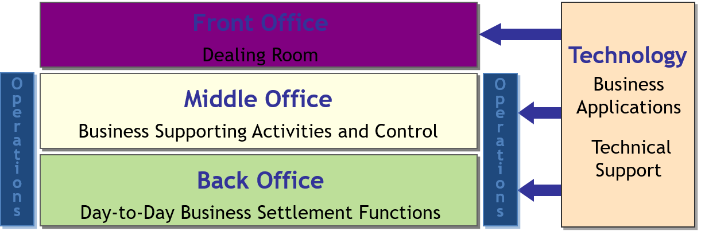
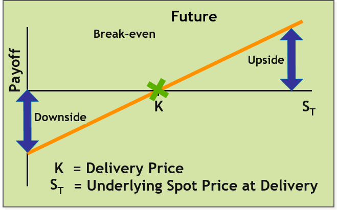
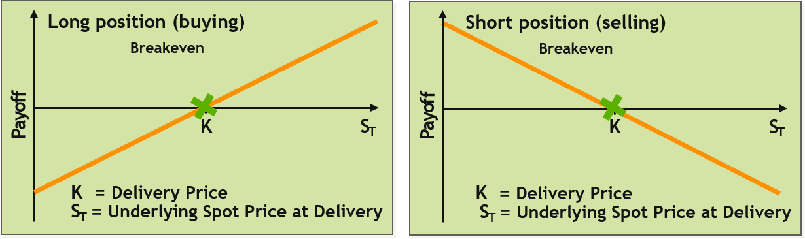
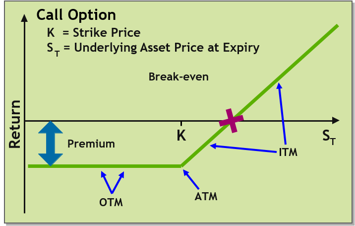
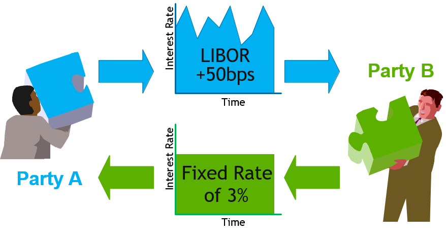

**Overview**

- Describe the types of markets that exist in the finance industry.
- Describe the functions of the Front Office, the Middle Office and the Back Office.
- Describe the types of derivatives that can be traded over the counter or on the exchange. 

**The Markets**

- Capital markets
- Money markets
- Commodity markets
- Derivatives markets
- Futures markets
- Insurance markets
- Foreign Exchange markets

**How do companies use the finance markets?**

- Companies tend to be borrowers from the markets for: 
  - Expansion
  - Investing in new assets / equipment
  - Cash flow
  - Re-financing

**How do individuals use the finance markets?**

- Many individuals are not aware that they are lenders! Almost everybody lends money in some ways: 
- Money in a savings account at a bank
- Contributions to a pension or savings plan
- Pay premiums to an insurance company policy (life, car, home etc)
- Invest in government bonds
- Invest in company shares

**Capital Markets**

- Stock market:
  - Provide financing through the issuance of shares or common stock, and enable the subsequent trading thereof.
- Bond market:
  - Provide financing through the issuance of bonds, and enable the subsequent trading thereof.

**Relative Advantages and Risks: Stock vs Bonds**  

|       | **Advantages**                                               | **RISKS**                                                    |
| ----- | ------------------------------------------------------------ | ------------------------------------------------------------ |
| Bonds | Contracted Interest Rate   Senior   Right in Bankruptcy      | Market   Risk   Default   Risk                               |
| Stock | Ownership Rights – Vote    Dividends   (Potential)   Capital   Gains (Potential) | Market Risk   Default Risk – Bankruptcy   Dividend   not guaranteed |

**Money Markets**

- Provide short-term debt financing and investment(12 months or less) via:
  - Short mortgage and asset-backed securities
  - Treasury bills
    - Commercial paper
    - Bankers‘ acceptances
    - Certificates of deposit

**Commodity Markets**

- Energy (oil, gas)
- Metals (iron, copper, gold, silver, platinum)
- Agriculture (orange juice, wheat, oats)
- Livestock and meat (live cattle, pork bellies)
- Other (rubber, wool)

**Derivatives Market**

- Provide instruments for the management of financial risk.
- The market can be divided into two:
  - Exchange-traded derivatives
  - Over-the-counter derivatives (OTC)

**Instrument Trading Methods**

- Exchange-Traded (XT) trading
  - Standarised terms
  - Commonly traded entities
    - Cash securities (stocks, bonds)
    - Indices
    - XT derivatives
  - Exchange Guarantees trades
    - Lower risk, higher prices
- Over-the-counter (OTC) trading
  - Flexible terms
  - Tailor-made (or customised)) products
  - Privately negotiated
    - Higher risk

**Underlying Instrument Asset Class Examples**

- Equities
  - AT&T stock
- Rates
  - Risk-free 10 year government bond, 5% annual coupon
- Indices
  - Portfolio products built to track market index
  - S&P500 or FTSE100
- Foreign Exchange (FX)
  - Exchange Swiss Franc (SwF) for US Dollar ($)
- Commodities
  - Gold, Silver, Platinum, Oil etc
- Synthetics
  - Products synthesised to manage credit exposure risk
  - Credit Default Swap (CDS)

**Futures markets**

- Provide standardised forward contracts for trading products at some future date (also forward market)
- The contract details the asset to be bought or sold, how, when, where and in what quantity it is to be delivered, the currency in which the contract will trade, minimum tick value, and the last trading day and expiry or delivery month
- Speculators on futures price fluctuations who do not intend to make or take ultimate delivery must take care to "zero their positions" prior to the contract's expiry!
- Contract will be settled, either by physical delivery or by a cash settlement
- The contracts ultimately are not between the original buyer and the original seller, but between the holders at expiry and the exchange

**Insurance markets**

- Facilitate the redistribution of various risks via ‘reassurance’ of:
  - Life
  - Marine
  - Automobile
  - Health
  - Home
  - Business
  - Professional Indemnity
  - Employer risks etc.

**Foreign exchange markets (FX)**

- Assists international trade and investment: 
  - Allowing businesses to convert one currency to another
  - Supports speculation another currency
  - Facilitates the ‘carry’ trade 

**Major Organisation Levels**

- Front Office
  - Generates revenue
- Operations
  - Middle Office (Controls business)
  - Back Office (Executes accounting and settlement)
- Technology supports all business divisions 

**Trade Negotiation Actors – Front Office**

- Clients
  - Buyers of bank instruments
    - Private clients
    - Companies
  - Financial institutions
- Front Office staff
  - Sales Person
    - Handle client relations
- Marketer
  - Maintain up-to-date market knowledge
  - Sell new IB products
  - Develop trade models
- Trader
  - Buy and sell IB products
  - Risk management of position

**Trade Capture and Risk – Middle Office**

- Trader assistants
  - Assist
    - Front Office traders
- Credit officers
  - Ensure
    - Trading within limits
- Risk analysis
  - Analyse
    - Trading patterns
    - Risk policy compliance
- Profit & Loss
  - Measure of financial gain
    - Or otherwise!
  - For particular period

**Account and Settlement – Back Office**

- Accounting
- Settlement

**Derivative Types**

- Futures
- Forwards
- Options
- Swaps

**Future Derivatives**

- Contract compels investor to buy or sell
  - Underlying asset
  - At pre-agreed delivery price
  - On delivery date
- Negotiation via futures exchange
  - Margin contract
  - Profit and loss settled daily
  - Via margin calls

**Forward Derivatives**

- Contract similar to future, with more flexibility
  - Parties seek each other out or employ Investment Bank intermediary
  - Contracts custom-made, without margin calls
- Payoffs from forwards

**Call & Put Option Derivatives**

- Option contracts 
  - Call option
    - Holder may buy asset at pre-agreed price at future date
  - Put option
    - Holder may sell asset at pre-agreed price at future date
- Option attributes
  - Underlying
  - Premium
  - Strike
  - Expiry date
  - Spot price
    - OTM*
    - ATM
    - ITM

**Option Types**

- Exercise style
  - European option
    - Exercise at expiry only
  - Multi-European (or ‘Bermudan’/’Mid-Atlantic’) option
    - Exercise at pre-agreed date windows
  - American option
    - Exercise at any time

**Swap Derivatives**

- Comparative advantage income scenario
  - Party A have floating, require fixed rate
  - Party B have fixed rate, require floating
- OTC fixed-to-floating interest rate swap contract
  - Exchange of two periodic legs* calculated over notional amount

**Instrument Classes**

- Vanillas
  - High volume liquid ‘plain vanilla’ products
  - Standardised
    - Terms, expirations, and strike prices
  - For example
    - Credit Default Swaps (CDS)
- Exotics
  - Customised derivatives
    - For example
      - Barrier options
- Hybrids
  - Cross-asset customised derivatives
  - For example
    - Collateralised  Debt Obligation (CDO)

**Credit Default Swap**

- Provides protection for owners of credit instruments
- Allows investors exposure to fixed income assets without owning them
- Bond holder effectively ‘insures’ against issuer defaulting

**Barrier Option**

- Underlying price level activates or inactivates option
- Activation/inactivation
  - Up or down
    - Whether underlying price initially above or below barrier
- Knock-in or knock-out
  - Whether contract initially activated or not

**Collateralised Debt Obligation (CDO)**

- Provides protection for owners of credit portfolios
  - Bonds/Loans – generates cash flow (Cash CDO)
  - CDSs/TRSs – no cash flow (Synthetic CDO)
- Allows investors exposure to fixed income assets 
  - without owning them

**Instrument Classes**

- Vanillas
  - High volume liquid ‘plain vanilla’ products
  - Standardised
    - Terms, expirations, and strike prices
  - For example
    - Credit Default Swaps (CDS)
- Exotics
  - Customised derivatives
  - For example
    - Barrieroptions
- Hybrids
  - Cross-asset customised derivatives
  - For example
    - Collateralised  Debt Obligation (CDO)