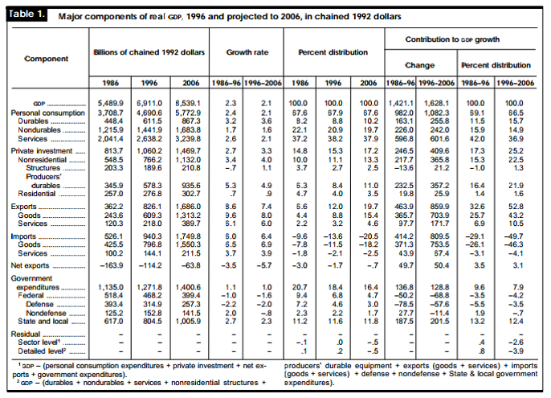
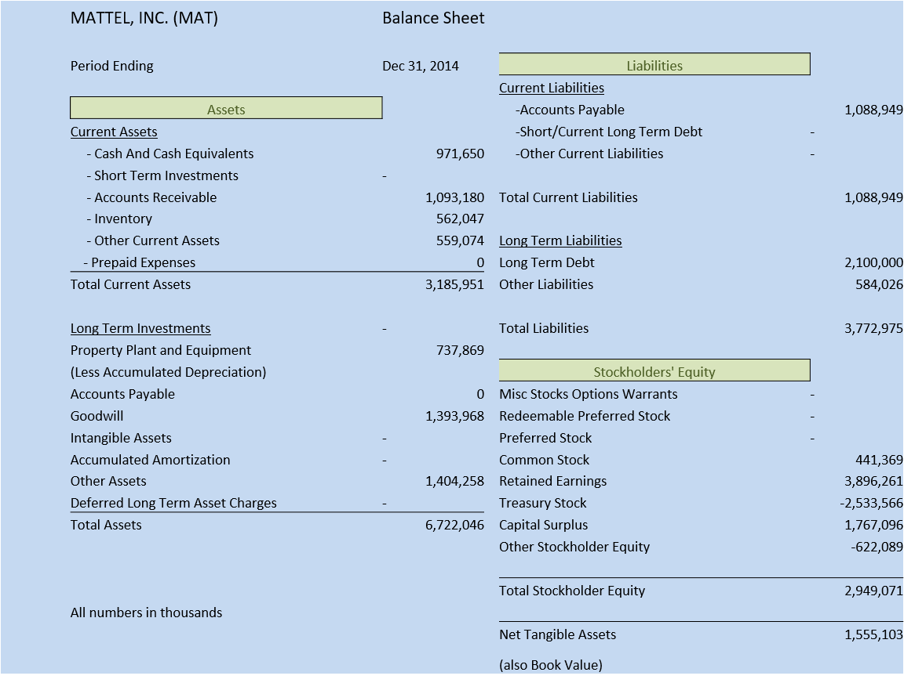
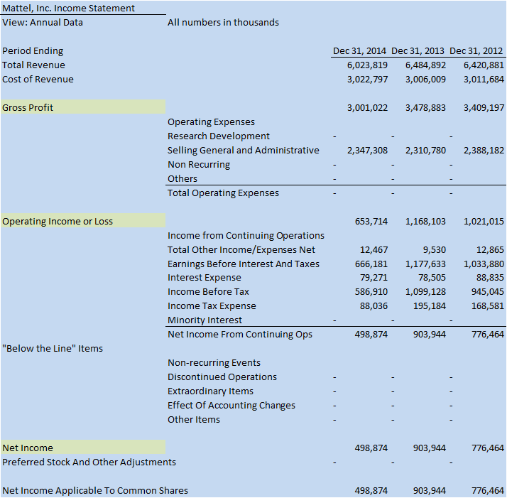
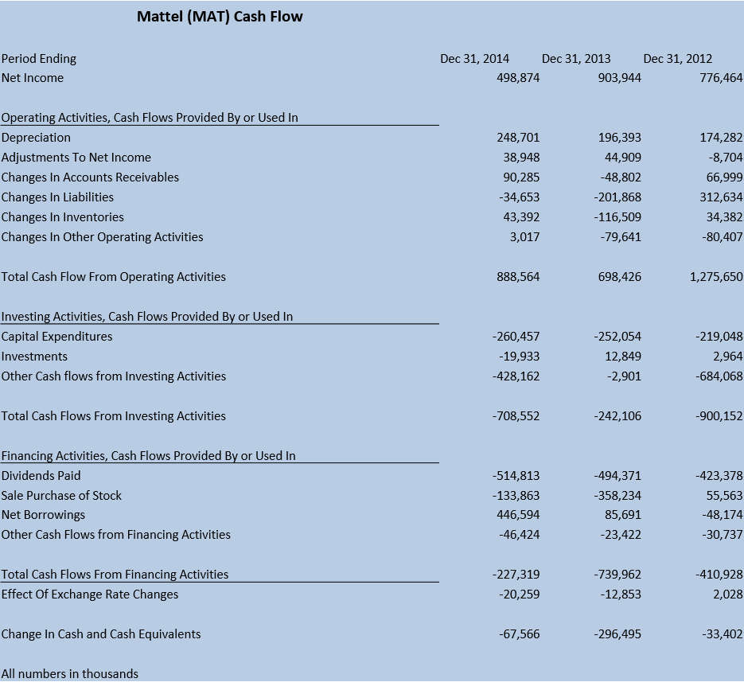
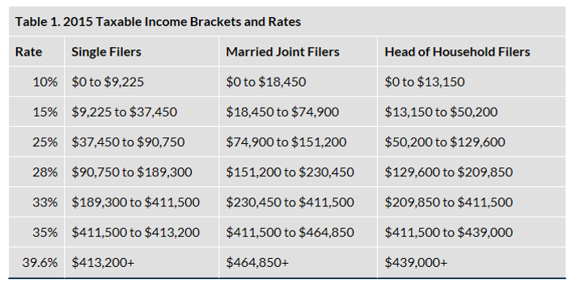
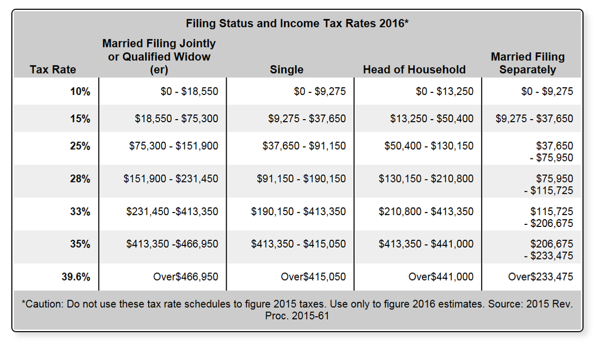

**Overview**

- Macroeconomics and Microeconomics
  - What is Finance?
  - Theory of the Operation of Monetary Policy 
  - Typical Accounting Forms
  - Financial Instruments Compared to Money
- The Financial Services Industry
  - U.S. Economy 
  - Markets and Their Operations
  - How an Investment Bank is Organized
  - A Typical Investment Bank Trade
  - Derivative Products
- The Trade Life Cycle
  - Major Players – and others
  - Straight Through Processing
  - Concurrent Processes	

**What is Finance?**

- The science of the management of money and other assets. (Free Dictionary)

- Finance is the application of economic principles to decision-making that involves the allocation of money under conditions of uncertainty.

**So what is Money?**

**Inflation/Disinflation Chart**

**What makes up Finance?**

**Three Areas Within the Field of Finance**

- Capital Markets and Capital Market Theory
- Investment Management
- Financial management

**Capital Markets and Capital Market Theory**

- The field of capital markets and capital market theory focuses on the study of the financial system, the structure of interest rates, and the pricing of risky assets. The financial system of an economy consists of three components: 
  - financial markets
  - financial intermediaries
  - financial regulators

**Financial Management**

- Financial management, sometimes called business finance or corporate finance, is the specialty area of finance concerned with financial decision-making within a business entity. 

- Another critical task in financial management is the risk management of a company. The process of risk management involves determining which risks to accept, which to neutralize, and which to transfer.

**Investment Management**

- Investment management is the specialty area within finance dealing with the management of individual (high net worth) or institutional funds (capital markets).
- Setting investment objectives starts with a thorough analysis of what the entity or client wants to accomplish.

**USA Economy**

- The US economy is a mixed economy including a strong private sector of companies and organizations which operate for profit and a public sector providing essential services such as emergency healthcare and education.

- The USA economy is an open economy which means the value of its currency fluctuates and there are no restrictions on the movement of goods and currency.

**USA Economy – Economic Indicators**

- Inflation 
  - Amount of money increases at a greater rate than the supply of goods
  - Result higher prices
  - Savings worth less
  - Federal Reserve attempts to control by raising interest rates 
- Indicators
  - Consumer Price Index (CPI) – The official measure of inflation

- Inflation Rate – based on CPI
- Gross Domestic Product (GDP) = value of all goods and services produced within the country
  - Balance of Payments = Exports - Imports
- Unemployment Rate
- USA budget deficit = Amount required for all public sector activities – Amount collected from taxation and other sources
- Interest Rate – cost of borrowing (tightening/loosening credit)
- Dow Jones– indicates the average share price for 30 companies traded in the USA

**US Economy – Exercise 10 minutes**

- Find out the current US values of:
  - Inflation, Unemployment, Official Interest Rate
- Compare USA inflation and unemployment rates with Canada, France, Germany and UK.  
- Also find the name of each country's central bank.

**Balance Sheet**

**Mattel (MAT) Income Statement**

**Cash Flow Statement**

**Financial Reporting Ratios**

- Liquidity
  - Current ratio--current assets divided by current liabilities
  - Net working capital ratio--current assets minus current liabilities, then divided by total assets. 
  - These ratios indicate a company's ability to pay its bills on time. Also discuss significant changes: 
    - For example, the company may have recently paid cash--a current asset--to buy new equipment, thus reducing the current ratio.
- Debt
  - Debt-to-equity ratio--total liabilities divided by total equity
  - Interest coverage ratio--earnings before interest and taxes divided by interest expenses
- Profitability 
  - profit margin--net income divided by sales
  - return on equity--net income divided by shareholders' equity
  - The profit margin ratio shows how much of each sales dollar flows to the bottom line. The return on equity ratio shows how efficiently management has deployed shareholder funds.

**Tax Brackets 2015**

**Tax Brackets 2016**

**Bond Trading**

- Bond premium
- Current yield rate

