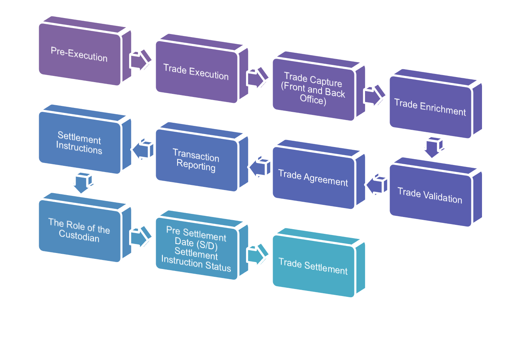
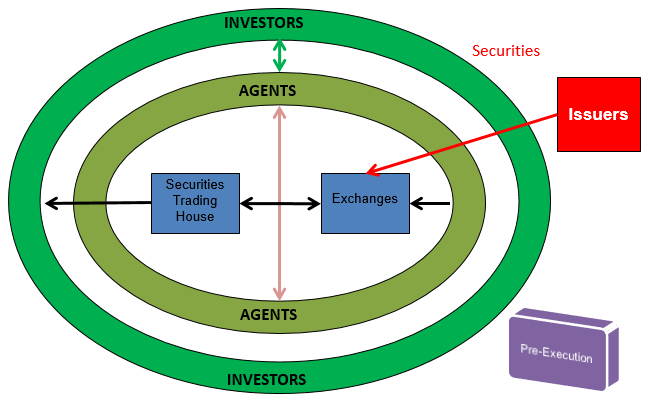
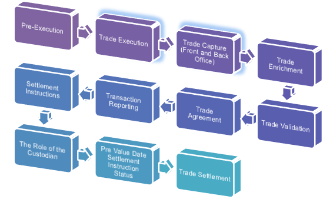
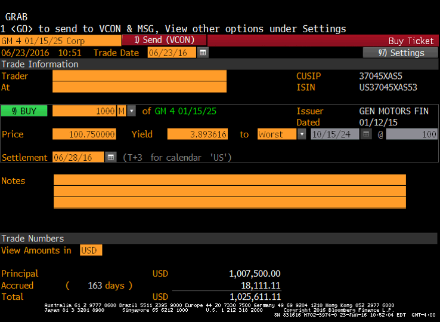
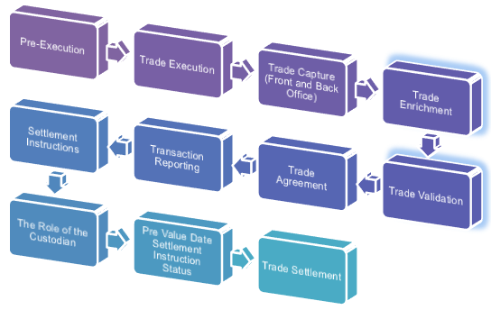
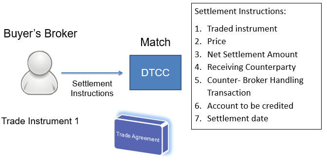

**Mini Overview**

- Describe the 5 stages of the Trade Lifecycle
- List different reports created by overnight processes.
- List different changes during the lifetime of a trade.

**Trade Life Cycle Overview**

**The Market Participants**

- Facilitator
  - Person or entity that assists in the process of trading securities
  - (E.G. Brokers, Dealers, Inter-Broker Brokers, Broker-Dealers, 	Salespeople, Investment Banks, Stock Exchanges, etc.)

- Investor
  - Person or entity looking to make a return on a capital investment
  - (E.G. Institutional Investors, Mutual Funds, Pension Funds, etc.)

- Issuer
  - Entity that issues securities to raise capital
  - (E.G. Corporations, Sovereign Entities, Local Governments, etc.)

- Other 
  - (E.G. Data Providers, Registrars, etc)

**The Marketplace**

**Market & Stock Exchanges**

- A Market is an environment in which securities are bought and sold. 
  Central to some market places is the Stock Exchange.
  - Trades can be executed over a centralized locations i.e “On-Exchange” or “Exchange Traded”
  - Other trades are executed through third party systems or locations i.e. “OTC” (Over the Counter) or Non-Exchange Traded
  - Each securities market has an associated and recognisable place to effect settlement
  - I.E. U.S. Government Bonds traded OTC via JPM Chase, Goldman Sachs etc. 

**Pre-Execution Activities**

- Negotiating the deal
  - Details of complex deals can be negotiated with a counterparty and provisionally inserted
  - A Master Agreement can be negotiated to act as a framework for future contracts with the same counterparty.
  - Deals are checked by Compliance and Front Office management; verified and approved prior to execution
  - At this point, a hedging strategy may be formulated 
- Order taking
  - Both Sales and Traders may take orders from clients
  - Orders may be aggregated before execution

**Trade Life Cycle Overview: Execution**

**Execution**

- Execution is when trade terms are mutually agreed upon and inserted into an electronic trade ticket
- For on-exchange trades (e.g. CME Futures), the immediate trade matching process between counterparties results in a legally binding trade
- For OTC trades (e.g. FX Spots/Forwards), a legally binding trade is achieved immediately when the trade is executed
- If material errors come to light upon subsequent trade matching, legal intervention might follow if the traders cannot resolve the situation
- Trade executions can take place over different media:
  - Face to face
  - Telephone (mobile usage limited/disallowed)
  - Email (approved systems only)
  - Online chat (approved systems only – Instant Bloomberg (IB))
  - Electronic trading platform (e.g. Murex)

**What is a Trade?**

- A legal contract between two ‘counterparties’ over a security. The SELLER must deliver the security, the BUYER must pay the agreed upon price of that security

**Why Trade?**

- Accumulation
  - The possible benefit from the securities increasing in value, the dividends on shares, or the interest payed on bonds. 
- Speculation
  - Profiting mainly from the price fluctuation of the purchased security.    
- Hedging:
  - The reduction of risk 

**Trade Tickets**

- Contain the terms, conditions and basic details of a trade (static data)
- Each counterparty will have their own version (buy or sell) of the trade ticket for the deal – all other details should match
- Automatically generated when executed on exchanges
- For OTC deals each trader will prepare their own trade ticket

**Trade Life Cycle Overview: Matching and Confirmation**

**Trade Matching**

- Exchange-traded deals:
  - Buyers and sellers automatically matched within clearing systems
- Each counterparty sends their OTC trade tickets  to the other counterparty’s back office:
  - Back office looks for discrepancies between the two versions of the trade ticket
  - The process is increasingly automated (electronic)
  - Mistakes are corrected
  - Material differences may result in legal intervention
  - Does not affect legal status of the trade

**Trade Agreement/Matching**

- Trade agreement is when the counterparty confirms the trade (trade affirmation) or when a trade is matched.
- Trade Affirmation 
  - Where one party executes the trade details and the counterparty is sent the trade details from a trade affirmation facility. The counterparty can then agree or disagree to the trade.
- Trade Matching 
  - Where two parties execute the trade details and the trade matching facility returns settlement instructions to the counter party 

**Trade Life Cycle Overview: Post Booking**

- Take place after the matching & confirmation process but before settlement:
  - Payment of fees (Broker fees etc.)
  - Managing Settlement Instructions (SI’s)
  - Trade Matching
  - Reporting of errors
  - Cash flows
  - Monitoring:
    - P&L (Profit & Loss)
    - VaR (Value at Risk)
    - NAV (Net Asset Value)
  - Settlement

**Instruction Content**

**Overnight Processes**

- Information from trades is aggregated each night to produce a series of reports by trade, portfolio and asset class:
  - Profit & loss
  - Absolute (total to date)
  - Incremental (Daily, weekly, monthly)
  - VaR (Value at Risk)
  - Net Asset Value (NAV)
  - Risk
  - Trading activity
  - Collateral requirements
  - Cash flow requirements for settlement

**Trade Life Cycle Overview Settlement**

- Types of Settlement
  - Physical settlement – commodities 
  - Cash settlement
  - Holder doesn’t exercise an option

**Settlement Terms**

- Settlement is the process when parties exchange goods and cash.
  - Value Date – day when value is set for a fluctuating asset
  - Contractual Settlement Date  – date when payment is processed, but product doesn’t have to received on same day
  - Actual Settlement – trade is completed when seller receives payment and buyer attains asset
  - Settlement Date - day when transaction of asset/cash is done.

**Settlement Concerns**

- Confirm seller has financial products at respective custodians

- Guarantee buyer has appropriate cash for payment.
  - Can be through funding, multiple balance payment accounts
  - Can be through credit with the custodian (or other parties)
  - Can be through a collateral agreement to offset the funds.

**Inventory Management**

- Managing assets to be sold.
- Inventory Management ensures:
  - There is adequate stock of product
  - Products are at location need to be
  - Products are deliverable on requested date

**Netting**

- Two counterparties add up profit & loss from all trades with each other.
- A single payment settles all of the trades.
- Must be agreed in advance by the two parties.

