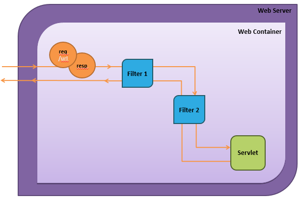

**Agenda**

- Attributes and Scopes
  - ServletContext
  - HttpSession
- Filters
  - Uses and benefits
  - Implementation
- Listeners
  - Uses and benefits
  - Implementation

**Other Scopes**

- So far you have seen how to use the HttpServletRequest object to set attributes in the request scope.
- We can add attributes to other scopes as well:
  - Session scope
  - Application scope

- To do this, we will need to use API objects that represent those scopes.

- Recap: Scope refers to the visibility and lifetime of a variable (or other data). I.e. the context in which it can be used.

**ServletContext**

- ServletContext is an object that represents the context of the entire application.
  - Created at startup
  - Only one exists per application
  - Contains configuration for the entire web app
  - Application scoped

- We can access it from any Servlet by calling getServletContext() 
- Once we have it, we can call setAttribute() and getAttribute() on it 

- Caution: These attributes will be accessible from multiple threads.

**Sessions**

- HTTP is stateless
  - Every request is independent of every other request
  - Each connection only exists for one request and one response
- An HttpSession object may be created to maintain a session for a particular client
  - Allows web app to recognize multiple requests from same client  
  - E.g. Adding items to an online shopping cart
  - Session scoped
- Once we have an HttpSession, we can call setAttribute() and getAttribute() on it 

- When a new session needs to be started, the container creates an HttpSession object, and assigns to it a jsessionid
- This ID is carried back to the client in a cookie in the response
- The client’s subsequent requests include this ID – the container can use it to retrieve the associated session

**How to Use Sessions**

- To obtain an HttpSession object, we call:

``` java
HttpSession session = request.getSession();
```

- If this request is already associated with a session, that session will be retrieved
  - If not, a new one will be created

- To check which of the above took place, we can call `session.isNew()`
- To manually end a session, we can call `session.invalidate()` For more information, refer to the API on HttpSession.

**Filters**

- Filters are another type of web app component.
- They can intercept an HTTP request for additional processing.
- We can use a filter to:
  - Authenticate and block requests based on user identity
  - Log and track users of a web app
  - Compress the response stream
  - Alter or append to the response stream

- Java EE filters are an example of the Intercepting Filter design pattern.



**Filter Benefits**

- Filters can help us in the following ways:
- Can add functionality without modifying existing Servlets
- Can apply the same piece of functionality to multiple Servlets
  - Less code duplication
- Can enhance entire application
- Which filters apply to which requests is configured in web.xml
  - Deployer can reconfigure as needed

**How to Implement a Filter**

- Filters are created and declared in a similar way to Servlets:
  1. Create a filter class that implements Filter interface
  2. Declare the filter in web.xml with the <filter> tag
  3. Map the filter to URL patterns with the <filter-mapping> tag

- When a request is received, the container invokes all Filters mapped to the same URL as the request.

- For each request, the container creates a FilterChain object, to keep track of which Filters to apply, and in which order.
- A Filter’s doFilter (ServletRequest, ServletResponse, FilterChain)  method is where processing takes place.
  - Calling FilterChain.doFilter() will forward the request to the next component
  - This could be another Filter, or the destination Servlet

**Filter Chaining**

- Suppose we map a URL pattern to Servlet A, and then apply two filters, Filter X and Y, to that same URL pattern. 
- A request for that URL travels through the following methods:


- This can be seen as a conceptual “call stack” for the HTTP request!

- The call stack is conceptual, because implementation details depend on Container implementation.

**Demo 1 – Applying a Filter**

- Step 1 – Servlet
  - Create a basic Servlet.
- Step 2 – Filter
  - Create a simple Filter.

- Step 3 – web.xml
  - Declare the Servlet and map it to a URL pattern.
  - Declare the Filter and map it to the same URL pattern.
- Goals: Apply a Filter to a request.

**Listeners**

- Java provides pre-defined Listener interfaces (8 total) 
  - Each represents a category of web container events
  - Each has methods to be called in response to those events
- An implementation of the Observer pattern
  - The events indicate state changes
  - Your Listener implementations are the “observing” code

- They are interfaces receiving notification events in the web container, including state changes in the servletContext, HTTPsession and ServletRequest objects. By implementing predefined interfaces such as servletContextListener, etc, the web container will notify you of certain events that are happening in your application.

- They are very powerful and have a lot of potential uses, such as intercepting request to perform logging and tracking HTTP session.

**Implementing Listeners**

1. Create a class to implement one or more of the Listener interfaces (ServletContextListener, HttpSessionListener, etc.)
2. Implement all methods of that interface
3. Register in web.xml inside the <web-app> tag:

``` xml
<listener>
    <listener-class> com.fdm.project.MyListener 
    </listener-class>
</listener>
```

- The web container will instantiate your listeners, note which interfaces are implemented, and call your implementations when events take place.

**Review**

- What is a Filter?
- What are the benefits of using Filters?
- How do you implement a Filter?
- What is a FilterChain?
- What is a Listener?
- How do you implement a Listener?
- How does Java EE handle sessions?
- What is the ServletContext object?


