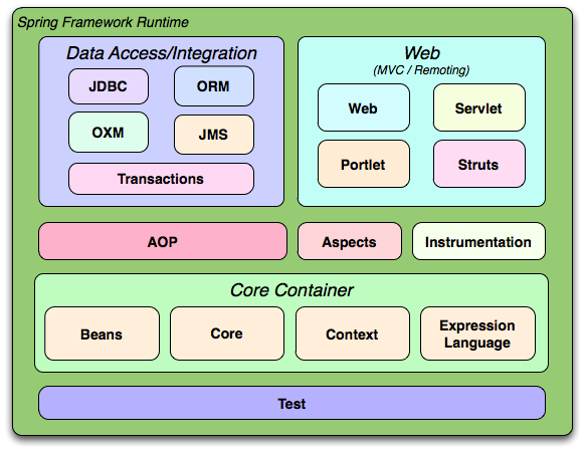
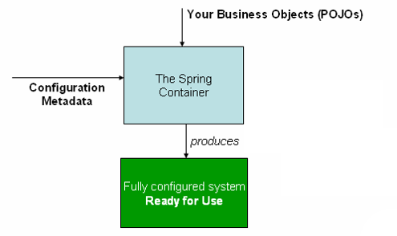

**What is Spring?**

- Spring is an open source framework that sits on top of Java.

- It is made up of a series of JAR files (dependencies to add in Maven).

- Provides an abstract layer to some of the more complex parts of Java.

- Spring helps structure whole applications in a consistent, productive manner, encouraging SOLID design.

**Spring Benefits**

- Lightweight
  - The basic version of spring framework is about 2MB.
- Inversion of Control (IoC)
  - Loose coupling is achieved in Spring using the technique IOC. 
- Aspect Oriented Programming (AOP)
  - Spring supports AOP and enables cohesive development by separating business logic from cross-cutting concerns.
- Container
  - Spring contains and manages the lifecycle of objects.
- Boilerplate code
  - Spring provides templates which allow you to reduce the amount of boilerplate code. For example, JDBCTemplate

- The basic version of spring includes those in the core container module.



**Components**

- The Spring Framework consists of features organised into about 20 modules.
- These modules can be used individually or in conjunction with each other.
- For example, an application that needs to connect to a database might use the JDBC  module. If this application is a web application, it might also use the web module.
- This course covers the core container modules, AOP and Web. All other modules are not in the scope of the course.

**Spring Core Container**

- The Spring Core Container is the heart of Spring
- It is configured using an XML file. This file contains bean information and describes how these beans are configured and introduced to each other.
- The container then manages the lifecycle of these beans, from creation to destruction.
- A bean can simply be thought of as a POJO (Plain Old Java Object).
  - They are nothing special
  - They container getters and setters
  - They are just simple java objects like the ones you have used up until now

**Spring Core Container**

Bean descriptions are fed in to the container in XML format. The container then instantiates the beans which can then be used by the application.



**Inversion of Control **

- The IoC concept says that you do not create your objects but describe how they should be created

- If an object depends on another, you do not connect them together yourself – you merely describe which objects are needed by which.

- The container is then responsible for hooking it all up.

- This reduces code in the application, eliminating the need for instantiation and factories.

- There are two types of IoC container (more on these later):
  - BeanFactory
  - ApplicationContext

**Lifecycle of a bean**

- The Spring Framework is transparent and thereby hides most of the complex communication that happens between the Spring Container and the Spring Beans. 

- The five main stages of the lifecycle are:
  - Creation
  - Injection
  - Validation
  - Registration
  - Destruction

- Info on the five main stages of the bean lifecycle are below. For more information on each, with code examples, visit: http://www.javabeat.net/life-cycle-management-of-a-spring-bean/

**1. Creation**

- The container will look for the configuration metadata of the given bean.
- Once found, the container will create an instance of the object (using Reflection).

**2. Injection**

- After creation, it’s dependencies will be injected into the bean. If these dependencies are other beans, they are created first.

**3. Validation and Registration**

- It is possible for your classes to implement certain interfaces which usually have one or two methods to implement. If these interfaces are implemented, these methods are invoked at this stage of the lifecycle, in this order:
  - BeanNameAware (if you want the instance to have a property set: the property being a name of the bean)
  - BeanClassLoaderAware (if you want the instance to have a ClassLoader set as a property – the ClassLoader which loaded it)
  - BeanFactoryAware (if you want the instance to have a BeanFactory set as a property – the BeanFactory which created it).
  - ApplicationContextAware (if you want the instance to have an ApplicationContext set as a property – the ApplicationContext which created it).
  - BeanPostProcessor. Contains two methods: postProcessBeforeInitialization() is invoked now, before the properties are set. The other is postProcessAfterInitialization()
  - Init-method (Not an interface): It is possible to set one of the bean’s methods as an init-method. If done, this method will be invoked now.
  - The other method in BeanPostProcessor is invoked: postProcessAfterInitialization() which is done after the properties are set.

**5. Destruction**

- If the DisposableBean interface is implemented, the method destroy() is invoked at this stage (may be useful for closing Connection objects).

- It is possible to set one of the bean’s methods as a destroy-method. If done, this method will be invoked now.

**IoC Implementations**

- There are two key Inversion of Control (IoC) implementations to know about:
  - Dependency Pull
  - Dependency Push (AKA Dependency Injection)

**Dependency Pull**

- The objects “asks” for the dependency
  - By calling a method in a factory class

``` java
public class PullExample{

    public void addStockExchangeToBroker(Broker broker){
        
        SEDaoFactory factory = new SEDaoFactory();
        StockExchangeDao dao = factory.getStockExchange();
        int id = broker.getId();
        StockExchange se = dao.findBrokersStockExchange(id);
        broker.setStockExchange(se);        
    }
}
```

**Dependency Push / Injection**

- Something outside of the object “pushes” its dependencies into it. 

- The object does not ask for it. It also doesn’t care where it came from. It just assumes it is there.

``` java
public class PushExample {

    private StockExchangeDao dao;

    public void setStockExchangeDao(StockExchangeDao dao){
       this.dao = dao;
    }

    public void addStockExchangeToBroker(Broker broker){
        int id = broker.getId();
        StockExchange se = dao.findBrokersStockExchange(id);
        broker.setStockExchange(se);
    }
}

```

**Dependency Push** **vs** **Dependency Pull**

- Dependency Push / Injection is better for two reasons:
  - The code is more decoupled.
    - You don’t hard code dependencies between classes. Instead, you configure them outside of the code (in XML in Spring). This makes it easier to inject a different implementation if required.

- Testability is improved.
  - As stated previously, the object doesn’t care where the dependencies come from as long as they are there. So you can easily inject mock objects.

**Inversion of Control **

- A generic term. Rather than the application calling methods in a framework (where the application is in control), the framework calls implementations provided by the application, “reversing” the control.

**Dependency Injection (DI)**

- DI is a form of IoC. Dependencies are passed into an object from the framework, rather than the object having to get the dependencies itself.


