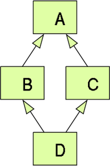

**Module Objectives**

- Write a well-formed abstract method
- Produce a well-formed interface
- Produce well-formed abstract classes
- Identify how many data types a single object has
- Identify whether or not Java allows multiple inheritance

**Abstract Classes**

- An abstract class is a class that cannot be instantiated.

- Marked with abstract modifier
- Can contain instance/static member variables
- Can contain instance/static method implementations
- Can contain abstract methods

**Abstract Methods**

- A method can be marked abstract.

- Has no method body
  - Semicolon instead of curly braces
- Can only belong to an abstract class or interface
  - Will not compile in a concrete class!
- If a concrete class inherits an abstract method, it must implement it

**Abstract Method Syntax**

- Legal concrete method:

``` java
public void doSomething() {
	...
}	
```

- Legal abstract method:

``` java
public abstract void doSomething(); 	
```

- Illegal – Cannot be abstract and have a body:

``` java
public abstract void doSomething() {
	...
}
```

**Abstract Classes and Methods**

``` java
public abstract class Product {
	public abstract double calcPrice();  // Per unit or by weight?
}
```

``` java
public abstract class PerishableProduct extends Product {
	public abstract String getExpirationDate(); 
    // Could be printed 											   
    // or calculated
}
```

``` java
public class WholeMilk extends PerishableProduct {
	// Both abstract methods are inherited and MUST be implemented
	public double calcPrice() { ... }
	public String getExpirationDate() { ... }
}
```

**Interfaces**

- An interface describes how the outside world (other classes) can interact with a class.
- An interface is a list of abstract methods.
- When a class implements an interface:
  - It guarantees to provide the behavior listed by the interface
  - It gains the data type that the interface defines (IS-A)
- Modifiers can be omitted:
  - All methods are implicitly public and abstract
  - All fields are implicitly public static and final

- Interfaces can extend other interfaces, even multiple at a time:

``` java
interface Flyer {
	void fly();
}
interface MechanicalFlyer extends Flyer {
	void refuel();
}
```

``` java
class Airplane implements MechanicalFlyer {
   public void fly() {
      /* MUST implement */
   }
   public void refuel() {
      /* MUST implement */
   }
}
```

- Abstract class can defer the implementation of interfaces to child class:

``` java
interface Flyer {
	void fly();
}

interface MechanicalFlyer extends Flyer {
	void refuel();
}
```

``` java
abstract class Airplane implements MechanicalFlyer {
	/* No need to implement methods */
}

class CommercialPlane extends Airplane {
	public void fly() {
		/* MUST implement */
	}
	public void refuel() {
		/* MUST implement */
	}
}
```

**Interfaces - Default**

- The default keyword allows default implementation of methods in interfaces
- Use default keyword before return type in method signature to allow implementation body
- Implementing classes do not have to override – default implementation will be used
- Implementing classes are able to override method if behavior needs to be changed

``` java
public interface IntBinaryOperator {
    int calculate(int num1, int num2);
    
	default int calculateAll(int num1, int num2, int[] nums){
		int result = calculate(num1, num2);
        for(int num : nums) {
          result = calculate(result, num);
        }
        return result;
	}
}
```

**Interfaces - Static**

- Allows static methods in interfaces
- Belong to the interface; can only be seen and called through the name of the interface
- Functionally identical to static methods in classes

``` java
public interface RandomGenerator {
	static int getRandomInt(int upperBound) {
		return (int)(Math.random() * upperBound);
	}
}

int i = RandomGenerator.getRandomInt(50);
```

**Multiple Inheritance**

- As of Java 8, multiple inheritance is possible.
- Abstract Classes do not have this problem:
  - A class can only extend one class
  - No diamond problem:
    - If classes B and C override a method from class Ain two different ways, which version does class D inherit?

- However, a class can implement multiple interfaces:
  - If 2 or more interface share the same method then the diamond problem occurs.
  - Java will force you to override this method in implementing classes to avoid the diamond problem.



**When to use which?**

- Abstract classes are part of the class hierarchy.
  - Meant to be extended by concrete classes
  - Can define base behavior with concrete methods
  - A class can only have one parent class, abstract or not
- Interfaces describe what an object can do.
  - A contract listing guaranteed behavior 
  - Implementations will differ class to class
  - Multiple interfaces can be implemented at once