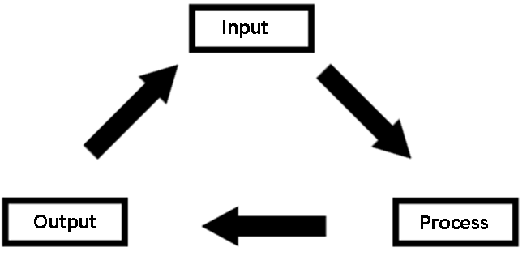
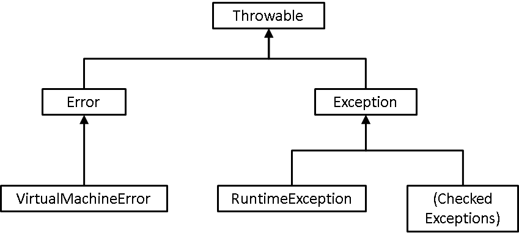
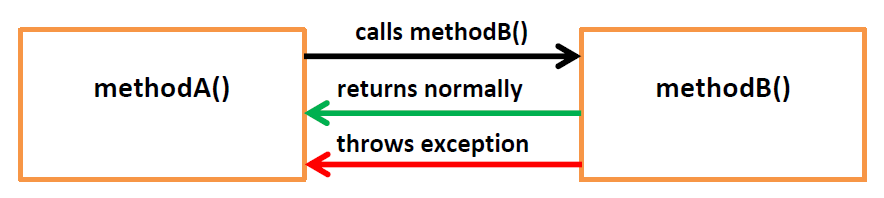

# File IO- Input/Output

So far, all the programs that we have written have been self-contained. Our Java code has not produced any real output (beyond some basic print statements to the console) and it has not required any external input.

In reality, these kinds of programs are rare. Most programs will require input from a user or another system and will in turn produce output for a user or another system, likely with some processing in between. An output from one system often becomes an input to another.

Another thing to mention is that any data we have been storing in our examples has been stored in Lists or Maps. Lists and Maps, typically are not a good way to store information about users or products. They are temporary stores that exists entirely in memory.

**Scenario**

**We have a website that allows users to register with our company. We store all of their data in a HashMap.**

**Question: If the server running our site goes down unexpectedly, or needs to be taken offline for maintenance, what happens to all of our user information?**

**Answer: It is lost.**

# Persistent Storage

We need some way of storing data permanently. Typically, a company would use a database for this purpose, but we will not be looking at database access just yet.

Instead, we will be using text files. Using text files as a database will require us to look at many of the key concepts required for using a persistent storage layer (like a databases), but is more straightforward to implement.

## BufferedWriter- Adding Data to a File

The first thing we will look at is adding data to a text file, to do this, we will use a *BufferedWriter* object.

BufferedWriter is a high level object that abstracts away much of the complexity of writing to a file. By default, the Writer objects that exist in Java write to files one character at a time, the *Buffered* writer buffers these characters and lets us write whole Strings.

In a new project, create a class called *BufferedWriterSyntaxExample* and give it a method called *writeLineToFile* that takes a String.

**public** **class** BufferedWriterSyntaxExample {

**public** **void** writeLineToFile(String line){

​      String filename = "example.txt";

​      **try** {

​            Writer writer = **new** FileWriter(filename, **true**);

​            BufferedWriter bufferedWriter = **new** BufferedWriter(writer);

​                  

​            bufferedWriter.write(line);

​            bufferedWriter.newLine();

​                  

​            bufferedWriter.close();

​      } **catch** (IOException e) {

​            System.*out*.println(e.getMessage());

​            e.printStackTrace();

​      }     

}

}

The above method will enable us to write a String to a file called *example.txt*. There’s a lot going on here though, so let’s break it down.

### File Paths

String filename = "example.txt";

The first line of the method defines the file name or more accurately, the *path* of the desired file to be made.

Just like in Unix, Java has the concept of both relative and absolute file paths. Where possible, it is advisory to use relative paths, this is because Java is designed to run on many different operating systems. Using absolute paths like the following will cause problems with portability:

**C:\users\first.last\documents** **ß** **This will not work on Unix/Linux or Mac based systems**

**/home/first.last/documents** **ßThis will not work on Windows based systems**

In addition, you’ll notice above that Windows uses a different convention for slashes than Unix based systems do. This *could* cause problems, but luckily, Java is smart enough to know what system it is running on and will convert paths accordingly.

**Always use forward slashes when defining file paths.** They will be translated to backslashes by the JVM if it is running on a Windows machine.

### Writer

Writer writer = **new** FileWriter(filename, **true**);

The buffered writer object is actually useless on its own. It requires a Writer object of some kind to perform the write operation, in our case, as we are writing to a file, we require a *FileWriter*.

The file writer will accept the path of the file to be written to and a boolean value that tells it whether it should overwrite that file or append to it (just like > and >> in Unix).

If the file does not exist, it will be created, if possible.

### BufferedWriter

BufferedWriter bufferedWriter = **new** BufferedWriter(writer);

Create our BufferedWriter object, giving it the FileWriter it will use to perform the actual write operations. As mentioned previously, the reason we are using BufferedWriter instead of simply the FileWriter is so that we can write using Strings, something that a non-buffered Writer cannot do.

### Writing to the File

bufferedWriter.write(line);

bufferedWriter.newLine();

We will now call the write method of the buffered writer (notice it is overloaded- we are using the one that accepts a String) passing it the String that our method accepts as an argument.

Once we have written the line we are adding a new line character, this step is optional, but often desired.

### Flushing  and Closing

bufferedWriter.close();

It is imperative that we call the close() method of bufferedWriter for two reasons:

\1.       The close method makes a call to the flush method

\2.       The close method will free up the resources being used by the bufferedWriter object

The first point is of particular importance. The writer object does not actually write directly to the file we have specified. It instead writes to an output *stream*. This stream acts as a buffer that is only actually written to the file when it is *flushed* (it is similar to pushing changes to the central database in SQL with commit).

We can call flush manually if we wish.

###  Exceptions

**try** {

​            //code

​      } **catch** (IOException e) {

​            System.*out*.println(e.getMessage());

​            e.printStackTrace();

​      }     

The above code, surrounding the rest of the required lines to write to a file is an example of dealing with a *checked exception*, we will discuss them shortly.

## Running Our Code

In a main method add:

**public** **class** FileIOClient {

​      

​      **public** **static** **void** main(String[] args){

​      BufferedWriterSyntaxExample fileWriter =                                      **new**BufferedWriterSyntaxExample();

​      fileWriter.writeLineToFile("Example line to write to a file");

​      }

}

Run this code (ctrl-F11). Nothing should appear to happen. Select your overall project folder in the Project Explorer in Eclipse and refresh it (F5 or right-click à Refresh).

At the bottom of your project a file called *example.txt* should appear. Double click it make sure it has been written to. If you wish, you can run your program a few more times and see that it will add several lines, one after the other.

# Exceptions

An exception deals with exceptional circumstances, that is, something that happens outside of the normal operation of your application.

When talking about exceptions in Java, they fall into 3 categories as outlined below (with some examples of each):

| **Checked   Exceptions** | **Unchecked/Runtime   Exceptions** | **Errors**         |
| ------------------------ | ---------------------------------- | ------------------ |
| IOException              | ArithmeticException                | OutOfMemoryError   |
| FileNotFoundException    | ClassCastException                 | StackOverflowError |
| SQLException             | IndexOutOfBoundsException          |                    |
| XMLParseException        | NullPointerException               |                    |

·         **Checked Exceptions**

o   **Deal with problems related to things external to our Java application**

·         **Unchecked/Runtime Exceptions**

o   **Deal with problems occurring because of code within our Java application**

·         **Errors**

o   **Indicate serious problems that most applications should not try and deal with**

Their relationship can be seen in the following hierarchy:

Note: there is no one class called checked exceptions, rather it is a category that encompasses a number different exception classes.

## Errors

As indicated above, errors usually indicate a serious problem has occurred during the execution of your application. Two of the most common are running out of memory on the heap or filling up the available memory on the stack.

Both of the above problems (and indeed, most errors) are unrecoverable. The only realistic way to deal with them is to re-boot the JVM and therefore your application.

## Unchecked or Runtime Exceptions

Runtime exceptions, sometimes called unchecked exceptions are a category of exceptions that occur due to bad coding.

They can be triggered by trying to reference a variable that doesn’t point to an object (*NullPointer*), trying to reference an element in an array that doesn’t exist (*ArrayOutOfBounds*) trying to divide by zero (*Aritimetic*) and a number of other circumstances.

They are called *unchecked* exceptions because we as developers should not be checking for the symptom (the exception) but should instead be checking for the cause- poorly written code.

The process of preventing unchecked exceptions from occurring is known as **Defensive Coding**. Defensive coding is typically achieved through the use of if statements to check the things we are about to do.

Instead of this:

**double** result = x/y;

Do this:

​                                **if**(y!=0){

​                  **double** result = x/y;

​            }

Instead of

​                                for(int i=0; i<10; i++){

​                  String name = nameArray[i];

​            }

Do this:

​                                for(int i=0; i<nameArray.length; i++){

​                  String name = nameArray[i];

​            }

## Checked Exceptions

The final category of exceptions, Checked Exceptions, is so named because we as developers do explicitly need to check if they have occurred.

Because they deal with resources or things that are external to our application (e.g. a file, a database, a user) there is no way for us to write our application in such a way to prevent them from occurring (no amount of clever Java code will help if the network connection to the database is down, for example).

As such, instead of preventing checked exceptions, we instead want to **deal with them gracefully**. If and *when* they do occur, our application shouldn’t crash, but should instead recover and try something else.

If the database is downà ask the user to try again later

If the file cannot be found à try another one

### Advertising an Exception

If there is a chance that a method may throw an exception, it must *advertise* that it does so.

The constructor of the *Writer* method used above is advertising that it may throw an exception.

**Question: Why might the FileWriter need to throw an exception?**

**Answer: For a number of reasons, some of which include- the Java programme doesn’t have write permissions to the specified path, the specified disk is full, it’s attempting to hit a network drive and the network is down.**

As such, any code that uses the *FileWriter* must be able to deal with the exception that will be thrown. An exception *may* not occur, but if it does, our code must be ready to handle it.

When a method that may throw an exception is called, such as method() in the diagram above, there are two options *only one of which will occur.*

\1.       The method runs and returns normally

\2.       Something goes wrong during execution and an exception is returned *instead*

**If an exception is thrown the method will not return anything.**

### Dealing with an Exception

There are two ways that code can deal with a method that may throw an exception.

\1.       It can catch and therefore *handle* the exception.

\2.       It can pass it on to which ever method called *it*, by throwing the exception itself.

There are no hard and fast rules governing whether a method should deal with an exception or throw it on to be dealt with by some other method. An exception should be caught wherever it makes sense to be dealt with, i.e. wherever a useful attempt to recover from it can be made.

**Golden Rule**

**If you catch an exception, DO SOMETHING WITH IT. Under no circumstances should a catch block (where the exception is handled) be left empty.**

#### Try-Catch

In our above example, we are *dealing* with the exception, which can be seen because the code is wrapped inside a try-catch block.

The **try** block will wrap around any code in which an exception *may* occur.

·         If no exception occurs, then the code inside the try block is ran, the catch block is skipped and the method continues to execute normally.

·         If an exception does occur, then the code inside the try block *stops* executing at whichever line threw the exception and skips straight to executing the code inside the *catch* block.

In our above example:

 **try** {

​            Writer writer = **new** FileWriter(filename, **true**);

​            BufferedWriter bufferedWriter = **new** BufferedWriter(writer);

​            bufferedWriter.write(line);

​            bufferedWriter.newLine();     

​            bufferedWriter.close();

​      } **catch** (IOException e) {

​            //Code to handle/recover from the exception goes here

​            System.*out*.println(e.getMessage());

​            e.printStackTrace();

​      }

If an exception occurs when trying to open the file (i.e. when constructing the *Writer* object) then none of the rest of the code inside the catch block will be executed. Instead, it will be skipped and the code in the catch block will be ran.

In this case, the catch block simple prints the error message to the console along with a stack trace. There are better ways of handling exceptions, but for the purposes of our example, this is fine.

Note that the catch block is designed to deal with a specific kind of exception, in this case an *IOException*. We can have multiple different catch blocks in the same try which will deal with different kinds of exceptions. We will see an example of this later in this walkthrough.

#### Finally

It is worth noting that there is an addition section we can add to our try-catch statements and that is **finally**. Any code we put inside the finally block will be executed regardless of whether or not an exception is thrown.

**try** {

​            Writer writer = **new** FileWriter(filename, **true**);

​            BufferedWriter bufferedWriter = **new** BufferedWriter(writer);

​            bufferedWriter.write(line);

​            bufferedWriter.newLine();     

​            bufferedWriter.close();

​      } **catch** (IOException e) {

​            //Code to handle/recover from the exception goes here

​            System.*out*.println(e.getMessage());

​            e.printStackTrace();

​      } **finally** {

​            //code here is guaranteed to be ran

​      }

#### Throwing the Exception

The other option for handling an exception is to not deal with it right away, but to instead pass it on to be dealt with somewhere else. As noted above, there are no rules about when this should be done. An exception should be dealt with where it makes sense to deal with it.

If our example were to *throw* its exception:

​      **public** **void** writeLineToFile(String line) **throws** IOException{

​            String filename = "example.txt";

​            Writer writer = **new** FileWriter(filename, **true**);

​            BufferedWriter bufferedWriter = **new** BufferedWriter(writer);

​            bufferedWriter.write(line);

​            bufferedWriter.newLine();

​            bufferedWriter.close();

​      }

It, like the method that it was calling, must **advertise** that it may throw an exception, it does so in its method signature:

​                                **throws** IOException{

In this way, whichever method calls our writeLineToFile method will be warned that it will need to handle the exception in some way, either in a try-catch, or throw it on again.

**Exceptions must eventually be handled somewhere!** If every method just keeps throwing the exception, eventually the exception will get back to main. If main throws it, it has nowhere else to go but the command line, which will cause the application to crash, the very thing we are trying to avoid in the first place.

# Persistent Storage

Now we have covered exceptions, we will go back to looking at reading and writing to and from our file. We have already covered writing, now, let’s look at reading.

## BufferedReader- Getting Data from a File

We will be using a BufferedReader object:

http://docs.oracle.com/javase/7/docs/api/java/io/BufferedReader.html

BufferedReader is a high level object that abstracts away much of the complexity of reading from a file. By default, the Reader objects that exist in Java read from files one character at a time, the *Buffered* reader buffers these characters and lets us read whole lines (as Strings).

**public** **class** BufferedReaderSyntaxExample {

​      

​      **public** String readFirstLineOfFile(){

​            String filename = "example.txt";

​            String firstLine = **null**;

​            **try** {

​                  Reader reader = **new** FileReader(filename);

​                  BufferedReader bufferedReader = **new**                                           BufferedReader(reader);

​                  firstLine = bufferedReader.readLine();

​                  bufferedReader.close();

​            } **catch** (FileNotFoundException e) {

​            // Do something to recover from the FileNotFoundException

​                  System.*out*.println(e.getMessage());

​                  e.printStackTrace();

​            } **catch** (IOException e) {

​            // Do something to recover from the IOException

​                  System.*out*.println(e.getMessage());

​                  e.printStackTrace();

​            }

​            **return** firstLine;       

​      }

}

The above code is not a million miles away from what we saw before, however, instead of using *Writer*s, we instead use *Reader*s.

### Key Differences

·         We do not need to add a boolean value into the constructor of the FileReader object as we do not need to consider whether we are overwriting the file or not like we did before.

·         We are only reading one line. The first one in this case

·         Try block has *two* associated catch statements.

o   We are catching FileNotFoundException

o   We are catching IOException

### Exception Inheritance

If you were to look at the API, then  you would see that FileNotFoundException is actually a sub-class of IOException. As such, we could in theory have just one catch block which simply caught an IOException. This would work because Dependency Inversion applies to exceptions in catch statements. *However* we may want to differentiate between the type of exception that is thrown and respond in one way if a FileNotFoundException is thrown and another if a IOException is thrown.

Note that as IOException is a general form of FileNotFoundException, Eclipse will warn you if you try to catch the IOException first because it will make the FileNotFoundException unreachable.

## Running Our Code

In your main method, write the following code:

**public** **static** **void** main(String[] args){

​      BufferedReaderSyntaxExample fileReader = **new**                                  BufferedReaderSyntaxExample();

​      String firstLine = fileReader.readFirstLineOfFile();

​      System.*out*.println(firstLine);

}

This should print whatever the first line of your file is to the console.

## Reading the Whole File

In general, reading just the first line of a file is not all that useful. It may be more useful to read *every* line in a file. As we read the lines from a file, we can either use them then and there, or store them in some temporary storage (such as a list or a queue) to allow us to process them later.

**public** List<String> readWholeFileAsList(){

​      String filename = "example.txt";

​      List<String> lines = **new** ArrayList<String>();

​      **try** {

​            Reader reader = **new** FileReader(filename);

​            BufferedReader bufferedReader = **new** BufferedReader(reader);

​            String line = bufferedReader.readLine() ;

​            **while**(line != **null**){

​                  lines.add(line);

​                  line = bufferedReader.readLine() ;

​            }

​            bufferedReader.close();

​      } **catch** (FileNotFoundException e) {

​      // Do something to recover from the FileNotFoundException

​            System.*out*.println(e.getMessage());

​            e.printStackTrace();

​      } **catch** (IOException e) {

​      // Do something to recover from the IOException

​            System.*out*.println(e.getMessage());

​            e.printStackTrace();

​      }

​      **return** lines;           

}

You can see from the API of BufferedReader’s readLine() method that it will return a null if the end of the file is reached. As such, we can use a while loop to continuously read from the file, one line at a time, until the end of the file is reached (line is equal to null).

For each line that is read, it is put into a List object called lines. Once the end of the file has been reached, this list is returned to the calling method (in our case main). We can then process the lines held in the list.

For example, we could print them out:

**public** **static** **void** main(String[] args){

​      BufferedReaderSyntaxExample fileReader = **new**                                  BufferedReaderSyntaxExample();

​      List<String> allLines = fileReader.readWholeFileAsList();

​      **for**(String tempLine : allLines){

​            System.*out*.println(tempLine);

}

# A Note on OO Design

You will notice that the above two examples have kept write and read operations in separate classes. This is generally good design, as combining them into one class breaks the Single Responsibility Principle of a class only needing one reason to change.

Later, we will look at ways be can further refine our design to make testing our read and write operations more easily, for now though, you should focus on getting comfortable with the syntax.