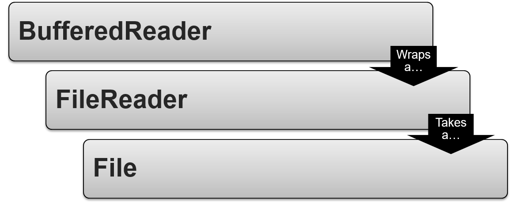

**Pre-Unicode**

- Character set – mapping between number and symbol
  - ASCII
    - Codes 32 – 127 represented English characters
    - ‘Spare’ bit represented extra characters
    - 128-255 differed in every country (e.g. Character code 130 would represent é in France, but Hebrew letter Gimel  ג in Israel)
- ANSI code pages
  - Only one on each computer 
  - e.g. Greece DOS used code page 732. Israel DOS used code page 862
- Rise of Internet necessitated multi-languages on one system…

**Unicode**

- Unicode
  - Character set standard
  - Each letter is assigned a hex number (eg. U+0639)
    ‘Hello’ would be U+0048 U+0065 U+006C U+006C U+006F

- UTF-8
  - Developed to improve efficiency (no wasteful 0’s)
  - Each code from 0 – 127 stored in a single byte, like ASCII and ANSI
    ‘Hello’ is now 48 65 6C 6C 6F
  - Codes higher than 127 use from 2 – 6 bytes

- Platform independent

**Basic IO**

- Streams
- Basic IO
- File IO
- Data IO
- Reader-Writer

**Streams**

- Stream – a flow of data with a writer at one end and a reader at the other
- Comes in two directions:
  - Input – Source of data a process can read from 
  - Output – Destination a process can write to
- The output of a process might cause the user to determine what input comes next.  However, it doesn’t always have to be a  user, it could be automated.


**Combining IO Classes**

- Combining IO classes is called wrapping or chaining.



``` java
File file 			= new File(“myFile.txt”);
FileReader reader 	= new FileReader(file);
BufferedReader in 	= new BufferedReader(reader); 
```

**Streams**

- Represented by four abstract classes in the java.io package:
  - InputStream
  - OutputStream
  - Reader
  - Writer

- All extend directly from Object
- InputStream and OutputStream are based on bytes – low level
- Reader and Writer are based on characters
- Streams are used for serialization.  To serialize an object is to convert its state to a byte stream so that it can later be converted back to a copy of the object. 

**Basic IO**

- InputStream and OutputStream define basic functionality for reading and writing bytes.

- Many classes extend them to provide a concrete implementation.

|  **InputStream**   |   **OutputStream**    |                       |                               |
| :----------------: | :-------------------: | :-------------------: | :---------------------------: |
|    void close()    |     Close stream      |     void close()      |         Close stream          |
|     int read()     |  Read a single byte   |     void flush()      | Forces any writes to complete |
| int read(byte[] b) |  Read multiple bytes  |   void write(int b)   |     Writes a single byte      |
|                    | void write (byte[] b) | writes multiple bytes |                               |

- There are more methods.
- Although int read() reads a byte value, the return type is an int. This is because java use a convention from C language to indicate the end of a stream with a special value. Byte values are returned as integers in a range of 0 to 255 and the special value of integer -1 is used to indicate that end of stream has been reached.  

- Three system streams are already provided:
  - System.in
    - An InputStream
    - Represents the standard input stream
  - System.out
    - A PrintStream (a type of OutputStream)
    - Represents the standard output stream
  - System.err
    - An PrintStream (a type of OutputStream)
    - Represents the standard error stream
- Created by the JVM when application starts
- Destroyed when application stops

**File IO**

- The following provide concrete implementations that read from and write to files on the local filesystem:
- FileInputStream (extends InputStream)
  - Reads raw bytes from a file
  - Good for reading image data
  - Constructors: FileInputStream(String name), FileInputStream(File file), FileInputStream(FileDescriptor fdObj)

- FileOutputStream (extends OutputStream)
  - Writes raw bytes to a file
  - Constructors: FileOutputStream(String name), FileOutputStream(FileDescriptor fdObj), FileOutputStream(String name, boolean append), FileOutputStream(File file), FileOutputStream(File file, boolean append)

- The JVM will recognise both relative and absolute paths.
- FileInputStream(String path) 
  - path to a file can be specified
- FileInputStream(File file) 
  - file can be specified (will create a fileDescriptor object) 
- FileInputStream(FileDescriptor fdObj) 
  - FileDescriptor can be specified, they represent existing connection to a file.
- FileOutputStream(File file) 
  - file can be specified (will create a fileDescriptor object) 
- FileOutputStream(File file, boolean append) 
  - If the second argument is true, then bytes will be written 
- to the end of the file rather than the beginning.
- FileOutputStream(FileDescriptor fdObj) 
  - FileDescriptor can be specified, they represent existing connection to a file
- FileOutputStream(String path) 
  - path to a file can be specified
- FileOutputStream(String path, boolean append) 
  - If the second argument is true, then bytes will be written to the end of the file rather than the beginning.

**Data IO**

- The following add the ability to read and write simple data types, such as  numeric primitives:
- DataInputStream (extends FilterInputStream)
  - Reads any primitive except char.
  - Constructor: DataInputStream(InputStream in)
  - Methods: boolean readBoolean(), double readDouble, int readInt(), …
- DataOutputStream (extends FilterOutputStream)
  - Writes any primitive except char.
  - Constructor: DataOutputStream(OutputStream out)
  - Methods: void writeBoolean(boolean b), void writeDouble(double d), …

**Reader and Writer**

- Provide basic functionality for reading and writing characters.
- Provide support for Unicode
- Many classes extend from them to provide a concrete implementation of the following:

| **Reader**         | **Writer**            |                        |                               |
| ------------------ | --------------------- | ---------------------- | ----------------------------- |
| void close()       | Close stream          | void close()           | Close stream                  |
| int read()         | Read a   single char  | void flush()           | Forces any writes to complete |
| int read(char[] c) | Read   multiple chars | void write (int c)     | Writes a   single char        |
|                    | void write (char[] c) | write   multiple chars |                               |

- There are more methods.

**InputStreamReader/OutputStreamWriter**

- Extend from Reader and Writer classes.
- Provide a concrete implementation that reads/writes characters from/to any I/O stream.
- InputStreamReader 
  - Reads bytes and decodes them into characters. 
  - InputStream must be provided in the constructor.

- OutputStreamWriter 
  - Characters written to it are encoded into bytes. 
  - OutputStream must be provided in the constructor.

- Released so that InputStream and OutputStream could be adapted to deal with Unicode.

- Defaults constructor provide a default encoding schema, however you can specify one if you wish so.
- InputStreamReader in = new InputStreamReader (System.in, “UTF-8”) –reads an specified a charset.

- For top efficiency, consider wrapping an InputStreamReader within a BufferedReader. For example: 
  BufferedReader in = new BufferedReader(new InputStreamReader(System.in)); 

**FileReader/FileWriter**

- Extend InputStreamReader and OutputStreamWriter
- Concrete implementation that reads/writes characters from/to files on the local filesystem:
- FileReader
  - Reads character data from a file.
  - Constructors: FileReader(String Filename), FileReader(File file), FileReader(FileDescriptor fdObj)
- FileWriter
  - Writes character data to a file
  - Constructors: FileWriter(String name), FileWriter(FileDescriptor fdObj), FileWriter(String name, boolean append), FileWriter(File file), FileWriter(File file, boolean append)

**Buffered Streams**

- BufferedReader and BufferedWriter classes provide buffering.
- Provide methods to read/write larger blocks of characters at a time.
  - readLine(), writeLine()…
- Can increase efficiency by reducing number of physical read/write operations.

``` java
FileReader in = new FileReader("./data.txt");
BufferedReader br = new BufferedReader(in);
br.readLine();
```

**Module Review**

- What is a stream?
- What is an InputStream and OutputStream?
- What type of data InputStream and OutputStream deal with?
- Name a type of InputStream and a type of OutputStream.
- What is a Reader and a Writer?
- What type of data Reader and Writer deal with?
- Name a type of Reader and a type of Writer.
- How can reading or writing of character be more efficient?