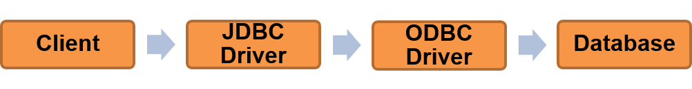
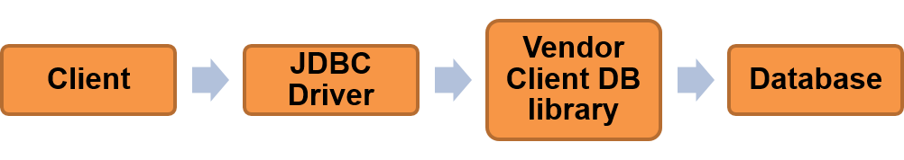
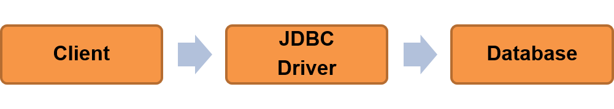
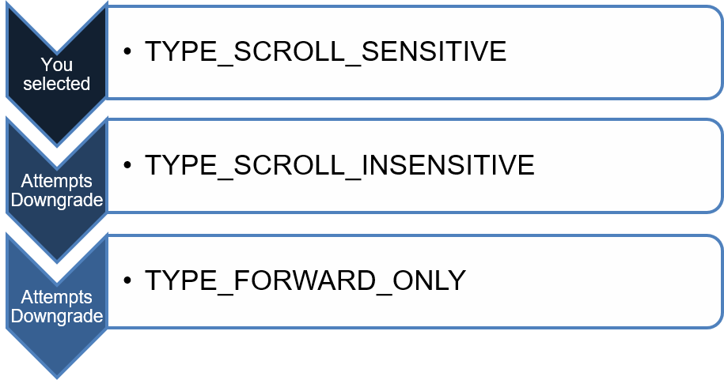

### Module Objectives

- List the common JDBC API interfaces
- Explain the purpose of the Driver Manager
- List the four different types of Drivers
- Load the JDBC driver and get a database connection
- Understand and implement statements
- Describe what a ResultSet is and its purpose

**Persistence**

- What does the word ‘persistence’ mean?
  - Continuous
  - To maintain
- To save data, can we use a collection?
- Why not?
  - They are volatile.
  - Once the program exits, all objects are lost from memory, including collections.

- There are several ways to persist data. (Object serialization, etc.)

- This session will focus on storing data to a database.

- The advantages of using a database include:
  - It is not local to a program – sometimes not even to a machine.
  - Portability
  - Vast storage space

**JDBC**

- Java DataBase Connectivity is an API that enables Java applications to interact with databases.

- There is only one concrete class called DriverManager.
  - Which manages the drivers!
  - Sets up JDBC for use by telling it:
    - The database vendor
    - Database location (URL)
    - Username & Password

- JDBC also consists of four key interfaces...

**JDBC Interfaces**

1. Connection
- Used to establish a connection (session).  
- The link between the Java application and the database.
- Concretion is provided by DriverManager and is vendor-specific.
2. Statement
  - Used as encapsulating layer for SQL statements.
  - Concretion is provided by Connection and is also vendor-specific
    - i.e. A MySQL statement differs from an Oracle Statement.

3. ResultSet
- Encapsulates data returned from the database.
- Represents a table of data.
- Returned when we execute a SELECT query through JDBC.


4. DatabaseMetaData
- Provides information about the database as a whole.
- E.g. How is the database set up? Default values?

- ResultSet is a return type of a method we run in Statement – executeQuery()

**DriverManager**

- Only concrete class in the API
- Will load the vendor specific driver
- Used to get a Connection object

``` java
DriverManager.registerDriver(
	new oracle.jdbc.driver.OracleDriver());
Connection conn = 	DriverManager.getConnection(url,user,password);
```

**JDBC Drivers**

- DriverManager needs to be given a driver.
- There are four types:
  - Type 1 Driver – JDBC-ODBC Bridge
  - Type 2 Driver – Native API Driver
  - Type 3 Driver – Network Protocol Driver (MiddleWare Driver)
  - Type 4 Driver – Database Protocol Driver (Pure Java Driver)

- Type 1 Driver (JDBC - ODBC bridge)
  - Connects Java clients to ODBC calls
  - ODBC driver



- Type 2 Driver (Native - API)
  - Converts JDBC methods into calls to client-side API on the DB side
  - Faster than type 1 drivers



- Type 1 - Translates query obtained by JDBC into corresponding ODBC query, which is then handled by the ODBC driver.
  - It converts JDBC calls to ODBC calls.  ODBC stands for Open DataBase Connectivity
    Advantages:
  - Any database vendor can be used.
  - You could change the database vendor and no changes would be required in the Java application.
    Disadvantages:
  - It is slow and expensive
  - All calls have to go through the ODBC bridge, then to the database, then back again.
  - The ODBC driver is required on every machine – the client machine where the java application resides and the server that is hosting the database.

- Type 2 - converts JDBC calls into calls to the client API for that database.
  - Uses the client-side libraries of the database.  The driver converts JDBC method calls into native calls of the database API
  - Advantages:
    - Much faster than a Type 1 driver.
  - Disadvantages:
    - The database vendor’s client library needs to be installed (so no support for applets).
    - Not all database vendors have a client library.
    - The driver is platform dependent. It is not written entirely in Java as it interfaces with non-Java code that makes the final database calls.

- Type 3 Driver (Network protocol)
  - Uses network protocols to communicate with a middle tier. 
  - Acts as proxy between the client and server.


- Type 4 Driver (Native protocol)
  - Connects directly to databases, without any native code or middle tier.
  - Written in pure Java
  - Thin driver



- Type 3 - Follows a three tier communication approach.
  - Can interface to multiple databases - Not vendor specific.
  - The JDBC Client driver written in java, communicates with a middleware-net-server using a database independent protocol, and then this net server translates this request into database commands for that database.  Thus the client driver to middleware communication is database independent.
  - The type 3 driver makes use of a middle tier (application server) between the program and the database. 
  - The middle tier converts JDBC calls into the vendor-specific database protocol.
  - You can interface to multiple databases with the same driver. The databases can be of any vendor.
- Advantages:
  - Database library is not required on the client machine. This is because the vendor specific logic is done on the Middleware.
  - To change a database, or add one, no changes are required in the Java program.
  - The middleware can provide services such as caching, loading balancing, logging and auditing.
  - A single driver can handle any, and multiple databases.
  - Platform independent as the driver is written entirely in Java and the platform-related differences are taken care of by the middleware
- Disadvantages:
  - Database specific coding is required on the middle tier.
  - The Middleware can cause slower speeds.

- Type 4 - communicate directly with a database, usually through socket connections.
  Converts JDBC calls directly into vendor-specific database protocol.  As the database protocol is vendor specific, JDBC requires separate drivers, usually vendor supplied. 
- Advantages:
  - Written completely in Java so it is platform independent.
  - No intermediary is required (such as ODBC). It connects direct to the database so it is faster.
- Disadvantages:
  - Drivers are database dependent as different database vendors use different protocols

**Implementation – Step 1**

- We will use the Oracle Thin Driver to connect to a database.

- Remember that DriverManager is used to:
  - Manage the drivers
  - Set up JDBC by telling it the following information:
  - The database vendor (in our case, Oracle)
  - The database location (URL)
  - Username and password

- First, we need to register the driver:

``` java
DriverManager.registerDriver(new oracle.jdbc.driver.OracleDriver());
```

**Implementation – Step 2**

- Next we need a Connection object to connect to the database.

- DriverManager.getConnection() will return one for us.

- There are three overloaded getConnection() methods:
  - getConnection(String url);
  - getConnection(String url, String username, String password);
  - getConnection(String url, Properties info);

- We will use the second option...

``` java
Connection conn = DriverManager.getConnection(
	“jdbc:oracle:thin:@oracle.fdmgroup.com:1521:xe”,
	“aUsername”, “aPassword”);
```

- The URL string takes the following format: 

``` java
jdbc:oracle:thin:username/password@oracle.fdmgroup.com:1521:xe
vendor | driver type | username & password (optional) | location (URL) | port | SSID
```

**DatabaseMetaData**

- Stores comprehensive information about the database as a whole. 
- Connection provides a concretion of the DatabaseMetaData interface:

``` java
DatabaseMetaData dbmd = conn.getMetaData();

System.out.println("Driver version: “ + dbmd.getDriverVersion());        
System.out.println("DB URL: “ + dbmd.getURL());    System.out.println("Others updates are visible?: “ + 	dbmd.othersUpdatesAreVisible(
		ResultSet.TYPE_SCROLL_SENSITIVE));
```

**Implementation – Step 3**  

- After making the connection, we need to get a Statement object to interact with it:

``` java
Statement statement = conn.createStatement();
```

- This object will encapsulate an SQL statement.

**Statement**  

- There are three execute methods we can run on the statement object:
- stmt.execute(String query);
  - For DDL (i.e. CREATE, DROP, ALTER)
  - Returns a boolean – indicates how to obtain further results, if available 

- stmt.executeUpdate(String query);
  - For DML (i.e. INSERT, DELETE, UPDATE)
  - Returns an int – the number of rows inserted, deleted or updated
- stmt.executeQuery(String query);
  - For SELECT queries
  - Returns a ResultSet object

**Statement Methods**

- Execute

``` java
String query = “CREATE TABLE testTable (testid INTEGER(5) PRIMARY KEY, name VARCHAR(50))”;
stmt.execute(query);
```

- ExecuteUpdate

``` java
String query = “INSERT INTO testTable (testid, name) VALUES (1,“insert”)”;
stmt.executeUpdate(query);
```

- ExecuteQuery

``` java
String query = “SELECT testid, name FROM testTable”;
ResultSet rs = stmt.executeQuery(query);
```

**ResultSet**

- Data in a ResultSet is accessed using a cursor.
- To begin with, the cursor is not pointing at any row. 
- Calling rs.next() will move the cursor to the next row.
  - Returns true if it moves to a row with data 
  - Returns false if it moves to an empty row

**ResultSet: Getting Data**

- To get data from a row in the ResultSet, getter methods are called:
  - getInt()
  - getString() (for VARCHAR type columns)
  - and more.
- Getter methods take in a column name or a column index.
  - Columns start at index 1.

``` java
while(rs.next()){
    int testid = rs.getInt(“testid”);   /* or rs.getInt(1); */
    String name = rs.getString(“name”);
    System.out.println(“Test id: ” + testid + “Name: ” + name );
}
```

**ResultSet: Handling Null**

- Database Null and Java Null concepts are not the same.
  - Java Null means reference does not point to any object. 
  - Database Null means unknown. 
- Primitive type getters (e.g. getInt()) return 0/false whether the value in the database is NULL or actually 0/false. 
- Solutions:
  - Use getBigDecimal() 
  - Use rs.wasNull() – returns true if the last column read was null

``` java
while (rs.next()){
	BigDecimal testPrice  = rs.getBigDecimal(“testValue”); 
	if (rs.wasNull()){
		/* handle Null field value */
} ...
```

**ResultSet Variations**

- Connection has three overloaded createStatement() methods:

``` java
Statement createStatement ();

Statement createStatement (int resultSetType, int resultSetConcurrency);

Statement createStatement (int resultSetType,	int resultSetConcurrency, 				 int resultSetHoldability);
```

``` java
Statement stmt = conn.createStatement(	ResultSet.TYPE_SCROLL_INSENSITIVE, ResultSet.CONCUR_UPDATABLE);
```

- Three attributes can be set when a Statement is created:
  - Type, concurrency, and holdability
  - Any ResultSet returned by this Statement’s methods will have the specified characteristics.

**ResultSetType**

- ResultSet.TYPE_FORWARD_ONLY  (Default)
  - Cursor can only move forward. 
  - Changes in the database will not be reflected in the ResultSet object.

- ResultSet.TYPE_SCROLL_INSENSITIVE
  - Cursor can move forward and  backward. 
  - Changes in the database will not be reflected in the ResultSet object.

- ResultSet.TYPE_SCROLL_SENSITIVE
  - Cursor can move forward and  backward.
  - Changes in the database will be reflected in the ResultSet object.

**ResultSetConcurrency**

- Determines whether the ResultSet is read only or can be updated.

- ResultSet.CONCUR_READ_ONLY (Default)
  - ResultSet cannot be updated.

- ResultSet.CONCUR_UPDATABLE
  - The columns of each row in the ResultSet can be updated when the cursor is on that row.

**ResultSetHoldability**

- Determines whether ResultSet stays open or is closed when commit()  is called.

- ResultSet.HOLD_CURSORS_OVER_COMMIT
  - The ResultSet will remain open after the commit() method is called

- ResultSet.CLOSE_CURSORS_OVER_COMMIT
  - The ResultSet will be closed after the commit() method is called

- Default holdability is implementation-specific. 
- Oracle only supports HOLD_CURSORS_OVER_COMMIT.

**ResultSet Downgrade Rules**

- Some types of result sets are not feasible for certain queries.
- For an updatable ResultSet:
  - Query can select from only a single table (no JOINs).
  - Query cannot use SELECT * 
  - Query must select only table columns (no derived columns/aggregates).
  - Inserts must use all non-nullable columns and all those without a default value.
- For a scroll-sensitive ResultSet:
  - Query cannot use SELECT * 
  - Query can select from only a single table (no JOINs).

- If chosen type is not feasible, it will be downgraded according to the following rules:



- Call rs.getType() to verify the ResultSet type.

**Module Review**

- What is the name of the only concrete class in the JDBC API?
- List the main JDBC API interfaces.
- What is a result set?
- Why is calling rs.next() necessary?