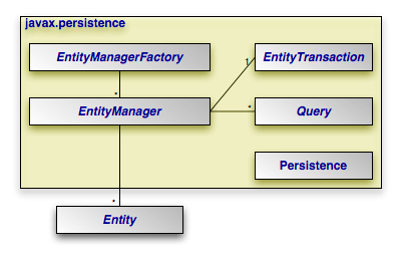

**Module Objectives**

- After completing this module you will be able to:
- State the purpose of the Java Persistence API (JPA).
- Identify and describe the main interfaces and classes.
- List the main elements that are needed in order to use JPA.
- List the main related technologies.
- Contrast normal JDBC queries with Java Persistence API.

**Introduction**

- What is persistence?

- Almost all applications require persistent data
- Objects have transient state, but some need to be saved past the life of the application process
- Using a relational DB is one way of doing this
  - The database models our business requirements
  - JDBC is a low-level API for interacting with a relational DB

- What is ORM (Object Relational Mapping)?

- ORM is a technique that maps object state to data in a relational database
- Mismatch issues between OO and relational models exist and need to be taken into account:
  - Subtyping – Fundamental to OO, absent in RDBMS
  - Granularity – One object’s data could be stored in multiple tables
  - Relationships – Associations in OO, foreign keys in RDBMS

**Introducing JPA**

- What is JPA?

- ORM frameworks handle the task of mapping objects to tables
- The Java Persistence API (JPA) is the ORM solution in Java EE
  - Abstraction on top of JDBC
  - Metadata maps objects to tables
  - Easy way to perform CRUD operations
  - Comes with JPQL, an object-oriented query language

- The task of persisting Java objects to a relational database is currently being facilitated by a number of different tools that allow developers to direct persistence engines in converting Java objects to database columns/records and back. This task involves serializing hierarchically structured Java objects to a tabular-structured database and vice versa. Essential to this effort is the need to map Java objects to database columns and records in a manner optimized for speed and efficiency. 

- JPA is not a new technology; rather, it has collected the best ideas from existing persistence technologies like Hibernate, TopLink, and JDO. The result is a standardized specification that helps you build a persistence layer that is independent of any particular persistence provider. 

**History**

- ORM technologies are not a new concept
  - Some are older than Java itself
  - TopLink, for example, was originally developed in Smalltalk
- Many popular products were developed, both commercial and open-source (Hibernate)
- JPA collected the best ideas from these technologies into one standardized API
  - Still requires a persistence provider such as Hibernate, EclipseLink, or Apache Open JPA
  - Does not depend on any particular vendor

**Entities**

- Entity classes are the data we want to persist.

- Any object can be an entity with the following characteristics:
  - Persistent / “persistable”
  - Has an identity 
  - Transactional – transaction needed for changes to DB
  - Fine-grained 

- Metadata relates entities to records in the database
  - Specified with annotations (e.g. @Entity, @Id) or XML

- An entity is persistable because it can be created in a persistent store. The difference is that it is not automatically persisted, and that in order for it to have a durable representation the application must actively invoke an API method to initiate the process. This is an important distinction because it leaves control over persistence firmly in the hands of the application. The application has the flexibility to manipulate data and perform business logic on the entity, making it persistent only when the application decides it is the right time. The lesson is that entities may be manipulated without necessarily being persisted, and it is the application that decides whether they are or not.

- Persistent identity, or an identifier, is the key that uniquely identifies an entity instance and distinguishes it from all the other instances of the same entity type. An entity has a persistent identity when there exists a representation of it in the data store; that is, a row in a database 
  table. If it is not in the database then even though the in-memory entity may have its identity set in a field, it does not have a persistent identity. The entity identifier, then, is equivalent to the primary key in the database table that stores the entity state. 

- Although they can be created, updated, and deleted in any context, these operations are normally done within the context of a transaction because a transaction is required for the changes to be committed in the database. Changes made to the database either succeed or fail atomically, so the persistent view of an entity should indeed be transactional

- Entities are meant to be fine-grained objects that have a set of aggregated state that is normally stored in a single place, such as a row in a table, and typically have relationships to other entities. In the most general sense, they are business domain objects that have specific meaning to the application that accesses them. While it is certainly true that entities may be defined in exaggerated ways to be as fine-grained as storing a single string or coarse-grained enough to contain 500 columns’ worth of data, JPA entities were definitely intended to be on the smaller end of the granularity spectrum. Ideally, entities should be designed and defined as fairly lightweight objects of a size comparable to that of the average Java object.

**Key Interfaces and Classes**



- **@Entity** 
  - Marks classes that are Entities
- **Persistence**
  - Starting point
  - Creates EntityManagerFactory instances
- **EntityManagerFactory**
  - Creates EntityManager instances
- **EntityManager**
  - Used to manage the lifecycle of Entities and query the database

- **EntityTransaction**
  - Groups operations on persistent data into units of work that completely succeed or fail
- **Query**
  - Finds persistent objects that meet certain criteria
  - Allows use of both Java Persistence Query Language (JPQL) and Structured Query Language (SQL) 
  - Implementations are vendor-specific

**Implementation Overview**

- Three key steps:
  - Configure Entity classes with metadata
  - Provide configuration details in persistence.xml file 
    Create an EntityManagerFactory from which EntityManagers can be obtained
  - An EntityManager instance is then used to perform CRUD operations and query the database.

**Persistence Context**

- The persistence context is the set of Entity instances in your application, managed by the EntityManager.

- When an EntityManager gets a reference to an Entity, that instance is said to be managed
  - Persistence operations can be carried out
  - EM will automatically sync Entity state with the DB
- Otherwise, the instance is said to be detached 
  - Seen as a regular POJO and can be used as such

**Implementation**

- persistence.xml
  - An XML file that defines persistence units
  - Should be placed in a directory called META-INF

- A persistence unit is used to configure:
  - Which Entity classes are to be managed
  - Persistence provider details
  - Database connection details and other properties

- On startup, the Persistence.createEntityManagerFactory() method tries to locate the persistence unit named helloworld. It searches the classpath for all META-INF/persistence.xml files and then configures the EMF if a match is found.

**Obtaining an** **EntityManager**

- Get an EntityManagerFactory from the class Persistence:

``` java
EntityManagerFactory emFactory =
		Persistence.createEntityManagerFactory(“persistenceUnitName”);
```

- It will be configured according to details in the given persistence unit.

- Once a factory is in place, EntityManager instances can be obtained:

``` java
EntityManager em = emFactory.createEntityManager();
```

- The name of the specified persistence unit “persistenceUnitName” passed into the createEntityManagerFactory() method identifies the given persistence unit configuration that determines such things as the connection parameters that entity managers generated from this 
  factory will use when connecting to the database.
- Be sure to close the EntityManager when you are done with it. When that is, depends on your design for the application. 

**Managing Entities**

- Using Transactions:

``` java
em.getTransaction().begin();
// Make changes to database
em.getTransaction().commit(); 
```

- Note: This must be done for all calls that may change the state of the database.

- Before you try to persist, remove or update an entity in the database you will need to begin a transaction, and then commit this transaction.

- Merge (UPDATE) can also be used in order to update entity but usually by using setters will apply the changed of the object state and sync the with the DB.

- **Persisting:**

``` java
// Create POJO
Employee employee = new Employee(158);

em.getTransaction.begin();

// Add to persistence context
em.persist(employee);  

// Send changes to database
em.getTransaction.commit();
```

- Before you try to persist, remove or update an entity in the database you will need to begin a transaction, and then commit this transaction.

- Merge (UPDATE) can also be used in order to update entity but usually by using setters will apply the the changed of the object state and synch the with the DB.

- Finding by ID:

``` java
Employee employee = em.find(Employee.class, 158);
```

- If found, a reference to a managed Entity is returned

- If not found, a null value is returned

- Note: A transaction is not required.

- **Deleting**:

``` java
// Obtain managed Entity from persistence context
Employee employee = em.find(Employee.class, 158);

em.getTransaction().begin();

// Instance removed from context
em.remove(employee);

// Send changes to database
em.getTransaction().commit();
```

- Before you try to persist, remove or update an entity in the database you will need to begin a transaction, and then commit this transaction.

- Merge (UPDATE) can also be used in order to update entity but usually by using setters will apply the the changed of the object state and synch the with the DB.

- **Updating:**

``` java
// Obtain managed Entity from persistence context
Employee employee = em.find(Employee.class, 158);

em.getTransaction().begin();

// Modify Entity state
employee.setSalary(50000);

// Send changes to database
em.getTransaction().commit();
```

- Before you try to persist, remove or update an entity in the database you will need to begin a transaction, and then commit this transaction.

- Merge (UPDATE) can also be used in order to update entity but usually by using setters will apply the the changed of the object state and synch the with the DB.

- **Merging:**

``` java
Employee pojoEmployee = new Employee(158);

em.getTransaction().begin();

Employee managedEmployee = em.merge(pojoEmployee);

em.getTransaction().commit();
```

- Takes in a detached Entity and retrieves the managed version
- If the given Entity does not exist in the database, it will be persisted

- **Querying:**

``` java
Query query = em.createQuery(
		“SELECT e FROM Employee e”, Employee.class);

List<Employee> allEmployees = query.getResultList();
```

- The JPQL code above will retrieve all Employees from the database.
- JPQL also allows the use of various clauses (WHERE, GROUP BY…)

**Module Overview**

- What is ORM?
- How does JPA map object data to tables and columns?
- List the four main interfaces in JPA.
- What is the purpose of the persistence unit?
- What is the purpose of the EntityManager?
- What does it mean for an Entity to be detached?
- Identify and contrast normal JDBC queries with the Java Persistence API