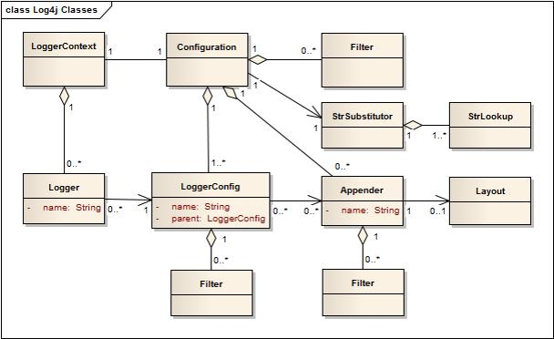
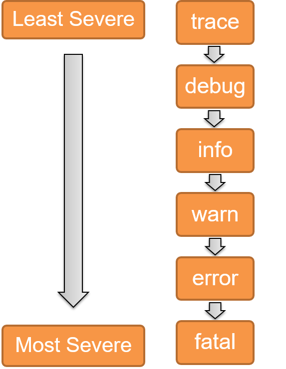

**Logging**

- When something goes wrong, the first point of call is the system logs.
- Logs provide a trace to figure out circumstances that cause issues, both at runtime and during debugging
- Logs are the main piece of information available to Support consultants and Developers
- Almost every large application devotes development efforts to logging, tracing, and/or auditing
- Logs help isolate and identify where problems occur
  - Critical in any system!
- Until now, you have been using System.out.println() to produce trace and debugging statements.

- From now on, you must use log4j2:
  - Highly customized logging
  - The debugger should also be used

- Other options include Java Logging, SLF4J

**log4j2**

- Hierarchical logging framework
  - Different levels of severity for different messages
  - Inheritable configuration
- Allows us to send different log messages to different locations simultaneously
- Allows configuration to be external to the code
  - Logging can be turned off or made to log only certain events without recompiling the source code
  - Can be configured even after deployment to the client

**Key Components**



- Loggers
  - Named objects that allow us to log messages according to level
    - One “root logger” object always exists
    - Child logger objects are created from configuration
- Appenders
  - Output destinations for log messages 
  - A single logger can have multiple appenders
- Layouts
  - Output formats for log messages 
  - A layout is set for each appender

- A log statement will be sent to every appender attached to a logger, and any of its ancestor loggers’ appenders.

``` java
Logger logger = LogManager.getLogger(“MyLogger”);

Logger logger = LogManager.getLogger(ClassName.class);

Logger logger = LogManager.getLogger();
```

- Creating the logger uses the LogManager class’s static method, which can accept a String, a Class object, or nothing:
  - Passing in a String will set the logger name to that String (Allows us to have Loggers for each object, not just each class)
  - Passing in a Class object will set the logger name to the fully-qualified class name (Standard practice)
  - Passing in no arguments defaults to the class name.

- LogManager.getRootLogger() will retrieve the root logger object.
  - Typically saved as a private static variable.

**Log Message Levels**

- Six logging levels
- Each is a method with the same overloaded argument signatures (there are many!)
- Logging requests are made by invoking one of these methods on a Logger instance

``` java
log.error(Object message);
log.error(String message);
log.error(Object message,
          Throwable throwable);
```



- Trace
  - use for debugging messages which let the developer know which parts of the source code have been reached. Examples include tracing method entry and exit. This level should only be used for developers.
- Debug
  - use for writing debugging messages which should not be printed when the application is in production. Developers and application support analysts may use these.
    Info: use for messages similar to the verbose mode of some applications: runtime events. Info and above should be considered public information.
- Warn
  - use for warning messages that are logged to some log but the application is able to carry on without a problem. Examples may be loading default configuration if a file cannot be located.
- Error
  - use for error messages that are logged to some log but the application can still hobble along. Examples may be when an exception is thrown and is handled, but the application must display some error.
- Fatal
  - use for critical message, after which the application quits abnormally.

**Appenders**

- Loggers need to know where to send your requests for logging.
- The log4j2 API allows us to select from a variety of output destinations:
  - Files (FileAppender, RollingFileAppender)
  - Console (ConsoleAppender)
  - Databases (JdbcAppender, NoSqlAppender)
  - Remote servers (SocketAppender, HTTPAppender)
  - Many more
    - This will be done when we configure our loggers…

**Configuration**

- Each logger object needs two pieces of information: 
  - A level / threshold (the minimum level of messages it will log)
  - At least one appender (where to send the messages)
- A logger must be configured with (or inherit)both of these in order to be used! 

**Configuration Hierarchy**

- Loggers follow a parent-child relationship (dot-separated)
- The root logger is at the top of the hierarchy
  - ex. A logger named com.fdm.Trading implicitly inherits configuration from logger com.fdm. If no configuration is defined for com.fdm, then com.fdm.Trading inherits configuration from the root logger.

- A logger without an assigned level inherits one from its parent
- A logger logs to its own assigned appenders and to all appenders above it in the hierarchy
  - ex. If the root logger is configured with fileAppender1, all loggers in the system will inherit and log to fileAppender1, in addition to their own appenders.

- This is where we can see the benefit to using the class object to name our loggers.

- Suppose we have a class named TradeManager and a class named Broker in the package com.fdmgroup.tradingplatform.

- If we call LogManager.getLogger(TradeManager.class), this will create a Logger object called “com.fdmgroup.tradingplatform.TradeManager”.
- If we call LogManager.getLogger(Broker.class), this will create a Logger object called “com.fdmgroup.tradingplatform.Broker”.

- We can define configuration for a Logger with the name “com.fdmgroup.tradingplatform” (even if we never use such a Logger), and both of the Loggers above will implicitly inherit the configuration. 

- This way, we can configure entire packages and sub-packages.

**Configuration**

- Configuration is automatically done by the log4j2 system at startup. It can be done in a variety of filetypes: .properties, .xml, .yaml, and .json.
- It is automatically loaded if the file is called log4j2.{fileType} and placed in src/main/resources
- If no configuration is present, log4j2 will use the default logger (printing all messages to the console).
- If configuration needs to be different in tests, it is common practice to have log4j2-test.{fileType} in src/test/resources.
- Configuration is automatically done by the log4j2 system at startup. It can be done in a variety of filetypes: .properties, .xml, .yaml, and .json.
- It is automatically loaded if the file is called log4j2.{fileType} and placed in src/main/resources
- If no configuration is present, log4j2 will use the default logger (printing all messages to the console)
- If configuration needs to be different in tests, it is common practice to have log4j2-test.{fileType} in src/test/resources.

**Configuration File Structure**

- Appender definitions
  - Where log statements should go
  - Which layout to use
  - Any other appender-specific configuration
- Logger configuration

``` java
<Root level="error">
	<AppenderRef ref="appenderName">
</Root>
```

- Remember: Any unconfigured loggers will inherit and utilise this configuration

``` java
<Logger name="loggerName" level="error">
```

**XML configuration log4j.xml**

```
<?xml version="1.0" encoding="UTF-8"?>
<Configuration>
  <Appenders>
    <Console name="StdOut" target="SYSTEM_OUT">
      <PatternLayout pattern="%logger - %msg%n" />
    </Console>
    <File name="FileAppender" filename="output.log">
      <PatternLayout pattern="%logger - %msg%n" />
    </File>
  </Appenders>
  <Loggers>
    <Root level="error">
      <AppenderRef ref="StdOut" />
    </Root>
    <Logger name="com.fdmgroup.log4j2" level="warn">
      <AppenderRef ref="FileAppender" />
    </Logger>
  </Loggers>
</Configuration>
```

**Module Review**

- What is the purpose of logging?
- What is log4j2?
- What is a logger?
- What is an appender?
- What is the hierarchy of the logging methods?
- How do you retrieve a logger object?
- How do you configure a logger?
- How do loggers inherit configuration?

