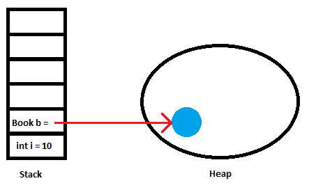

# Memory Handling Structures

Java maintains two distinct areas of memory in which it keeps track of variables and objects.

## Stack

The Stack is a **highly ordered Last In First Out (FILO) Queue**.

The stack stores:

- Primitive variables
- References to Objects on the **Heap**
  - An index within the stack acts as an alias to the piece of memory where the object is stored

- Method calls
  - Keeps track of which methods have been called in which objects. You will typically see these if Java encounters an error and prints out the *stack trace*

The is *one Stack per thread* within our programme (more on threads later)

## Heap

The Heap is an unordered, unsorted collection of Objects that have no relation to each other. Objects are accessed via the references that exist to them on the stack.

An object on the Heap may contain primitives or references to other objects as attributes.

There is *one heap per instance of the JVM*



The primitive variable i is contained entirely on the stack.

The book object b is held on the heap, but is referenced from the stack, which contains the object’s position in memory.

# Pass by Value vs. Pass by Reference

When a variable is passed from one part of a programme to another, such as into a method as a parameter, there are a number of ways that this can be achieved in terms of memory handling, depending on the language.

Typically a language will use one of the following methods, but some can use both.

**Pass By Value**

 *A copy of the value of the variable is passed. Changes to the copy do not affect the original.*

**Pass by Reference**

*The variable itself is passed from one scope to another. Changes to the variable in either scope are seen in the other.*

**Scope**

When talking about variables in programming, we often come across the term ‘scope’. Scope simply refers to the idea of a variable being bound to a name.

Scope is the reason that we cannot have two variables defined with the same name within the same method, but two variables in different methods can have the same name. In the latter case, they are in different scopes and therefore there is no chance of confusing them.

When talking about variable passing (value or reference) we are really talking about how we tell one part or scope of a program, about a variable defined in another part or scope.

# Pass by Value or Pass by Reference?

## Acid Test

You can easily test whether a language is Pass by Value or Pass by Reference by writing the equivalent of the following code in that languages syntax:

``` java
public class Application {
    
     public static void main(String[] args) {

           int i = 10;

           int j = 5;

           swap(i,j);

           System.*out*.println("i is equal to: " + i);

           System.*out*.println("j is equal to:"  + j);

	}
	public static void swap(int i, int j){

           int temp = i;
           i=j;
           j=temp;
     }
}
```

**Question**: What would you expect to be printed out if Java was Pass by Value? What would you expect to be printed out if Java was Pass by Reference? What actually is printed out?

**Answer**: Running this code reveals that after calling the function swap, i=10 and j=5, i.e. the method has had no effect on the variables. This tells us that Java is Pass by Value, as it was the copies within the other method’s scope that were swapped, not the originally defined variables.

**Java is Pass by Value Only**

This point cannot be stressed enough and is a mistake that people new to the language often make. Java *only* ever works via Pass by Value (even though it sometimes *looks* like it’s working by Pass by Reference). It *never* works via Pass by Reference; it is incapable of doing so.

In Java’s case, when a variable is passed from one scope to another (such as via a method call) a **copy of the Value** of that variable on the *Stack* will be passed.

**Key concept:** Objects are not copied! Only the reference that is pointing to them is copied. This can make Java *look* like it is Pass by Reference with respect to objects. It is not.

Again, acid test:

``` java
public class ApplicationObj {

public static void main(String[] args) {

            Book book1 = new Book();
            book1.setTitle("Starship Troopers");
            Book book2 = new Book();
            book2.setTitle("The Man Who Was Thursday")
			swap(book1, book2);
            System.out.println("Book 1 title: " + book1.getTitle());
            System.out.println("Book 2 title: " + book2.getTitle());
}

public static void swap(Book book1, Book book2){

           Book temp = book1;
           book1 = book2;
           book2 = temp;
     }
}
```

Note again that the book titles that are printed out as defined within the main method and have not been swapped around.

## Why the Confusion?

Consider the following piece of code:

``` java
public class UpdateObject {
     public static void main(String[] args) {
         Book book = new Book();
         book.setTitle("Ender's Game");
         updateTitle*(book);
         System.out.println("Book title is: " + book.getTitle());
     }
     public static void updateTitle(Book book){

         book.setTitle("Dune");
     }

}
```

Here, the book is being altered in the method *updateTitle* and the changes are being reflected in the original main method.

**Question**:  But didn’t we say that changes made in copies don’t change the original in in Pass by Value Languages?

**Answer**: Yes. But here we are not changing the Value type (which is the reference to the object). We are changing the Object (the thing it is pointing at). Be sure you are happy with the distinction as it a fundamental underpinning of the way the language works.

# Memory Management and the Garbage Collector

As a programmer in Java, we do not have to worry about memory management. One of Java’s guiding philosophies when it was created was that coding should be easy programmers should be able to focus on solving the problem at hand and not have to worry about whether they are going to run out of memory.

The Stack is in a constant state of change as the program executes. As methods are called and variables are defined, the stack constantly changes to reflect whichever variables are currently in scope.

The Heap is a  more complicated structure however. The Heap (and consequently, all of the objects stored there) is managed by Java’s **Garbage Collector (GC)**.

The Garbage Collector’s job is to analyse objects in the heap and keep track of when they are no longer being referenced at any point in the program (i.e. there are no references to them either in the stack or in another object). When the garbage collector finds an object that is no longer being referenced, it will remove it and free up the memory space it was taking up.

Some key things to know about the Garbage Collector:

- When the Garbage Collector is running *nothing else does*

- “Stop-the-World” pauses, as they are known, means that no part of your code will execute whilst the GC is running.

- The Garbage Collector is “generational”

- More detail on this is not required for the course, but there is an interesting article here if you want more information: http://javarevisited.blogspot.co.uk/2011/04/garbage-collection-in-java.html

- The Garbage Collector runs when it wants to

- There is a complex algorithm that governs when the Garbage Collector is scheduled, but the key thing to note is that *there is no way to force the garbage collector to run.*

**Note:** There are many, many implementations of the JVM beyond the default one provided by Oracle, which we have been using. The Garbage Collector is defined as part of the JVM and therefore implementation of the GC varies across JVM implementations.