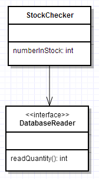

# Mocking Frameworks

Many modern Object Oriented languages have frameworks (libraries, if you prefer) that allow developers to utilise *Mocking* as part of the Test Driven Development Process. Java is no exception and whilst there are a number of mocking frameworks in Java, one of the most popular (and easiest to learn) is **Mockito**. 

## What is mocking and why would I want to use it?

Mocking frameworks typically provide a number of benefits for when we are applying the TDD process.

### 1.      Testing Behaviour

**Question: What is it that JUnit really tests? Are there any limitations to the types of methods we can test with JUnit?**

**Answer: JUnit tests State, that is, the values of variables at a given point in time. JUnit cannot test void methods. This is a big limitation.**

Mocking frameworks allow developers to write tests that test the *behaviour* of their application. Behaviour here is defined to mean a *method call*. As such we can invoke (call) a method within our application and then observe *which methods it calls* in other objects, *how many* *times* it calls those methods, and *the parameters that are passed to them*.

### 2.      Mock Objects

We can also use Mockito to produce M**ock Objects**. Mock objects are *fake* versions of real objects; they are hollow with no defined functionality. Methods inside mock objects perform no logic, if they are defined to return a value, they will simply return the default value for that type; zero for primitives or null for objects.

**Question: Why is this useful?**

**Answer: Isolation. They allow us to isolate parts of our system from one another.**

#### Scenario

Imagine you have just finished developing a class via unit testing that must make a series of calls to a database.

All of your tests pass, your code works as expected.

**Question: If the database crashes, should all your tests still pass? Does the fact that the database is down now mean that your code is incorrect?**

**Answer: Your code has not changed. Your tests should still pass. So we need a way that we can isolate our test code from the database. We will achieve this via mocking.**

### 3.      Dependency Injection

Finally, mocking encourages us to write code that makes use of Dependency Injection. Dependency Injection is the concept of *giving* an object all of the associated dependencies it needs to do its job, rather than have it make them itself.

Dependency injection allows us to write better Object Oriented code and ties in directly to Single Responsibility, Open/Close and Dependency Inversion, as we will see.

 

# Setting Up

We will be building on the Project in the previous JUnit walkthrough- **TDDBookShopWalkthrough**.

If you have not done so already, add that code to SVN so that we may revert to the earlier version if we wish.

Add the mockito dependency to the pom.xml of your project after your JUnit dependency:

``` xml
<dependency>

    <groupId>org.mockito</groupId>

    <artifactId>mockito-all</artifactId>

    <version>1.9.5</version>

    <scope>test</scope>               

</dependency>
```

## Test Scope Reminder

The <scope>test</scope> within our dependency tells our Maven project to only include these libraries when we are running our tests.

Remember: tests are for developers, not users. When we release our production code to our client base, we will not be sending our tests with it. As such, we shouldn’t include the JUnit or Mockito dependencies either.
 

# Mockito Example

## Requirements

We will be returning to our Book Shop application here, but adding some additional functionality.

**The book shop application will consists of a stock checker service that, before allowing a user to add a book to a basket, should make a call to the database and check whether that book is currently in stock.**

**The stock checker will take the unique ISBN of a book and make a call to a database to check how many are in stock.**

Note that the requirements talk about a database. You will not have covered how to make calls to a database from Java yet, so we will have to fake it using mocks (which is exactly how they are intended to be used).

## Creating a Test Class

As mentioned above, Mockito is designed to be used in conjunction with JUnit, not instead of it. As such, our tests will use much of the same syntax and ideas as our JUnit ones did.

Create a new JUnit Test Case called **StockCheckerTest**

At the top of the Test class, add the following import statements:

``` java
import org.mockito.*;

import static org.mockito.Mockito.*;
```

## Test 1

*The numberInStock method of the StockChecker object should make a call to the readQuantity method of a DatabaseReader object once when called.*

Initially, our test will look something like this:

``` java
@Test
public void test_NumberInStock_CallsReadQuantityMethodOfOurDatabaseReaderExacltyOnce_WhenCalled() {
    //Arrange
    String isbn = "ABC1234567";
    StockChecker stockChecker = new StockChecker();
    //Act
    stockChecker.numberInStock(isbn);          
    //Assert
    verify(mockDatabaseReader,times(1)).readQuantity(anyString());
}
```

As we can see, the Arrange/Act/Assert structure of the test is maintained, the difference here is that instead of using one of JUnit’s **assert** methods, we are instead using Mockito’s **verify** method as our actual test condition.

Within this test we are:

·         Creating our StockChecker object, which we will be testing

·         Making a call to the numberInStock(isbn) method of the stockChecker object, passing it an isbn to check

·         Verifying that, after we call numberInStock(isbn), the method readQuantity() is called 1 time in the object mockDatabaseReader and being passed a String of some kind

You can think of *verify* like a line of dominoes. We are flicking the first domino (calling the *numberInStock(isbn)* method) and watching what happens as a result. In this case, we are expecting a call to be made to the *readQuantity()* method in another object.

**Matchers**

**anyString() is part of a family of methods within Mockito called matchers. They allow us to be very general in defining our test conditions and are a good way to, at least initially just test that a method is being called and allows us to ignore what arguments it’s being called with.**

**Some other matchers are anyDouble() and anyInt(). Custom matchers can be defined as so (here, using Book as an example): any(Book.class)**

http://mockito.googlecode.com/svn/branches/1.5/javadoc/org/mockito/Matchers.html

So, we are expecting a call to a *mockDatabaseObject*, however the object *mockDatabaseReader* does not yet exist, so there is no way that its method can be called. Let’s think about what our UML may look like:



Ultimately, we will need to write a class that is capable of running queries on a database, we are not however currently interested in the *DatabaseReader* class, so we will simply define it as an interface and worry about it later (when we are, in turn testing *it*).

As such, *DatabaseReader* will not have an implementation; it won’t do anything. We cannot make any actual calls to a database. This is not a concern however, as we are currently interested in the *StockChecker* object. As long as it does its job correctly, we should be happy. What’s its job? To make calls to the *DatabaseReader*. What the *DatabaseReader* does when we call it is immaterial.

### mockDatabaseReader

Within our test, we are referring to an object called *mockDatabaseReader*, but where does it come from? We can’t instantiate a DatabaseReader because it is an interface (even if it weren’t, we still wouldn’t *want* to). We instead will make a *mock* object of type database reader.

A **mock object** looks like a real object, as far as our program is concerned, but is actually just a hollow representation of an object. This has two benefits:

**1.**       We can mock objects and interfaces that haven’t even been written yet and treat them as if they had been

**2.**       We can ignore the actual implementation of an object that *has* already been written

a.       The main benefit here is that if our database reader *had* been written and we were to use it directly, it would make dozens and dozens of calls to our database every time we ran our unit tests. Something we don’t want. Using a mock allows us to ignore that implementation and pretend it does nothing.

So, we’ll alter our test to add a mock database reader object. Mockito provides a build in method to create mocks that is straightforward to use.

``` java
@Test
public void test_NumberInStock_CallsReadQuantityMethodOfOurDatabaseReaderExacltyOnce_WhenCalled() {
    //Arrange
    String isbn = "ABC1234567";
    DatabaseReader mockDatabaseReader =m*ock*(DatabaseReader.**class**);
    StockChecker stockChecker = **new** StockChecker();
    //Act
    stockChecker.numberInStock(isbn);          
    //Assert
    verify(mockDatabaseReader,*times*(1)).readQuantity(*anyString*());
}
```

**Rule of Thumb**

**The only real object that you should have inside your test class should be the one you are testing. Everything else should ideally be mock objects. This means that we are fully isolating the class under test of any influencing outside factors, meaning we can focus on the class we are actually developing right now.** 

### Compiling Our Test

Let’s move onto step 2 of the TDD process and make our code compile:

·         Create an interface called DatabaseReader

o   Give it a method called readQuantity(String id)

``` java
public interface DatabaseReader {
    public int readQuantity(String id);
}

// Create a class called StockChecker
// Give it a method called numberInStock(String isbn)
public class StockChecker {
    public int numberInStock(String isbn){
        return 0;
    }
}
```

Your test should now compile. Run it and watch it fail; make sure you are happy with *why* it fails at this point.

### Making Our Test Pass

Step 4 of TDD asks that we get our test to pass in the simplest way possible. How can we do this?

One thing that may spring to mind is to create a new object of type DatabaseReader inside our StockChecker object and then call its readQuantity method. As it stands, this will not work as DatabaseReader is an interface (which we cannot instantiate). Even if DatabaseReader were a class though and we were to instantiate it and call its method, our test would still not pass as it would be a *different* object to the one in our test (which we are watching with verify).

In order to make our test pass, we need to pass a reference to our mock object from our test, into the class we are testing. We will use **dependency injection** to achieve this.

We need to add a custom constructor to our StockChecker object and pass it a DatabaseReader.

``` java
public class StockChecker {

     private DatabaseReader reader;  

     public StockChecker(DatabaseReader reader){
           thisreader = reader;
     }
     public int numberInStock(String isbn){
           return 0;
     }
}
```

It is now impossible to create a new StockChecker object without also giving it a DatabaseReader object of some kind (we’re using dependency inversion to allow us to pass any class that implements DatabaseReader). Once we have created our StockChecker, it will then have a *permanent member variable* of type DatabaseReader, so whenever it needs one, it will use the one we gave it at creation. These two objects are now *associated* with one another and will be until StockChecker no longer exists in memory.

Update our test to inject our StockChecker object a DatabaseReader:

``` java
@Test
public void test_NumberInStock_CallsReadQuantityMethodOfOurDatabaseReaderExacltyOnce_WhenCalled() {
    //Arrange
    String isbn = "ABC1234567";
    DatabaseReader mockDatabaseReader =*mock*(DatabaseReader.**class**);
    StockChecker stockChecker=n**ew** StockChecker(mockDatabaseReader);
    //Act
    stockChecker.numberInStock(isbn);          
    //Assert
    verify(mockDatabaseReader,*times*(1)).readQuantity(*anyString*());
}
```

Here we are injecting our *mock* DatabaseReader object into our StockChecker. When we run our program for real in a live environment, we will instead inject a real, functioning DatabaseReader and it will instead call a real object capable of making real calls to a database.

### A Passing Test

Now, at last, we can make our test pass by amending numberInStock(String isbn) in StockChecker to make the required call:

``` java
     **public** **int** numberInStock(String isbn){

​           reader.readQuantity("");

​           **return** 0;

​     }
```

Just pass an empty string into *readQuantity* for the time being.

Run your test, it should now pass.

## Recap

In writing our first Test, we have utilised the Mockito framework to produce a mock object, used dependency injection to associate it with the object that needs it and finally we have verified that one of the mock objects methods is called (as a result of calling the method we are actually testing). We also used a matcher to make our test simpler.

Note that it is impossible to use the *verify* method with real objects, so we are in fact *required* to use mock objects when testing behaviour within our system.

## Test 2

*When passed the ISBN number of a book, the stock checker method of book service should make a call to the database reader object exactly once, passing the ISBN number it was given to the database reader object.*

## Test 3

*If 3 copies of the book exist within the database, then when the database object returns the value 3, the stock checker method should return true.*