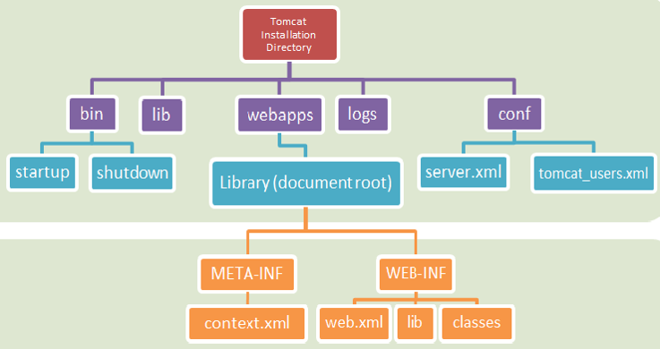

**Tomcat Directory Structure**



| **/bin**     | Contains startup and shutdown   scripts, amongst others.     |
| ------------ | ------------------------------------------------------------ |
| **/lib**     | JAR files that might be used by   multiple web apps.         |
| **/conf**    | Stores   configuration files and DTDs (Document Type Definition).  The most important is **server.xml**,   the main configuration file for Tomcat. |
| **/logs**    | Default location for log files.                              |
| **/webapps** | Where your web applications go.                              |

- Each time you make a change to the configuration of Tomcat, you have to restart the container

**WAR Files**

- A Java web application is a hierarchy of directories
- It can be ‘packed’ into a .war file (web application resource) – usually in order to deploy the app
- In its ‘unpacked’ state, the directory structure is convenient for developing
- WAR files can be created using:
  - The command-line jar tool
  - A build tool such as Ant or Maven
  - Eclipse (auto-generated)
- To deploy an application, place the .war file into the **/webapps** directory under the Tomcat installation.

**Document Root**

- The top-level directory of your application is the **document root**.
- Contains files that the client’s browser might request 
  - HTML, JSPs, images, JavaScript, CSS etc.
- The context path of index.html in your document root is:
  - /ProjectName/index.html

**WEB-INF Directory**

- **/WEB-INF** 
  - Not publicly accessible
  - Best practice is to place JSP files within WEB-INF
  - Static resources like CSS must remain outside

- **/WEB-INF/web.xml**
  - Web Application Deployment Descriptor
- **/WEB-INF/classes**
  - Java class files that are part of the application
- **/WEB-INF/lib**
  - All .jar files required by this application (Maven dependencies, etc.)

- **/WEB-INF/classes**
  - Java class files that are part of the application
  - Package structure needs to be reflected inside /WEB-INF/classes  
    - e.g. The ‘com.fdmgroup.User’ class needs to be in this directory structure: /WEB-INF/classes/com/fdmgroup/User.class

**META-INF Directory**

- /META-INF/context.xml – Used to define deployment configuration that is specific to Tomcat, such as: 
  - logging
  - data sources
  - session manager configuration
  - etc. 

**Starting Tomcat Manually**

1. In Tomcat’s ‘bin’ directory, run the startup script.
2. Once started, you will be able to see Tomcat’s home page in a browser by typing: http://localhost:8088.
   1. There are many useful links including Examples and FAQ’s.
3. To be able to access the management screen (where you can deploy your app) you need to have a username and password. 
   1. These can be found/added in the file:  **conf/tomcat-users.xml**

**Deployment with Tomcat**

- Deploying in Eclipse
  - We can benefit from the speed of using Eclipse’s UI to deploy a modified web app in Tomcat.
- Deploying manually (2 methods)
  - Copy the modified files to Tomcat.  You MUST restart Tomcat.  
  - Use an Ant build script or Maven to automate execution of commands. 
- It is typical to keep separate directories for source code and the deployable application. 
  - Source code is easier to manage when it is in a directory by itself. 

**Naming System**

- Like a library card system, a Naming System provides computer programs with a single location where they can access the resources they need. 
- We can use JNDI to allow applications to look up resources in an abstract, resource-independent way. 


**Introduction to JNDI**

- JNDI – Java Naming and Directory Interface
- Clients have the illusion that everything stored in the naming directory is a Java object. 
- Commonly used to set up a database connection.
- An InitialContext gives us an entrance into the naming system.  Once we have an initial context we can access an object by name. 

**InitialContext**

- In JNDI, all naming and directory operations are performed relative to a context (no root).
- An InitialContext implementation is provided for each webapp. 
- All configured entries and resources are placed in the java:comp/env portion of the JNDI namespace.

- In META-INF/context.xml:

``` xml
<Context antiResourceLocking="false" privileged="true" >
  <Resource name="jdbc/myoracle" auth="Container"
     type="javax.sql.DataSource"
     driverClassName="oracle.jdbc.driver.OracleDriver"
     url="jdbc:oracle:thin:@oracle.xyzcompany.com:1521:xe"
     username="yourUserName" password="YourPassword" 
     maxActive="20" maxIdle="10“ maxWait="-1"/>
</Context>
```

**Using a JDBC DataSource**

``` java
// Obtain our environment naming context 
Context initCtx = new InitialContext(); 
Context envCtx = (Context) initCtx.lookup("java:comp/env");

// Look up our data source 
DataSource ds = (DataSource)envCtx.lookup("jdbc/myoracle"); 

// Allocate and use a connection from the pool 
Connection conn = ds.getConnection(); 
// Use this connection to access the database...
conn.close(); 
```

**Review**

What are the main directories in Tomcat?
Which directories should be in the project document root?
Where are the startup and shutdown commands stored?
In which directory of your web app do you put static content?
In which directory of your web app do you put non-static content?
How do you gain access to Tomcat’s management screen?
How can we use Tomcat to get a DB connection?


