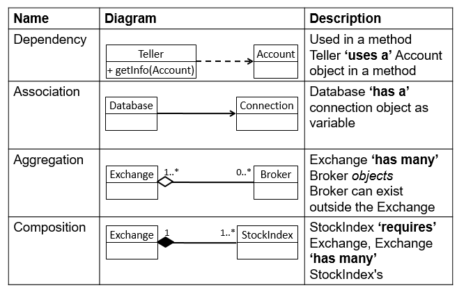

**Module Objectives**

- Describe the two different categories of UML diagrams
- Explain the use of Use Case, Activity, Class and Sequence diagrams.
- Demonstrate the use of class and sequence diagrams to design a real world application

**UML**

- **Unified Modelling Language**

- What is it used for?
  - Object Oriented Design
  - Data structure modelling
  - Scenario modelling
  - Logical flow modelling

- Two categories
  - Structural
  - Behavioural

**Use Case Diagram**

- Behavioural

- High level view, from the perspective of outside the system

- Models interaction between things external to the system (actors) and functionality within the system (use cases)

**Use Case Diagram**

**Activity Diagram**

- Behavioural

- Low level view

- Models logical flow of the system

**Object Oriented Programming Overview**

- OOP is a way of building software

- It is modular, with the class as the primary building block

- Classes contain 
  - Behaviour (things that they do)
  - Attributes (properties/state)

- A Class is a blueprint

- An Object is a real thing made from that blueprint
- What is the difference between the blueprint of a car and an actual car?

**Class Diagram**

- Structural

- Models the classes within an OOP program, including:
  - Their attributes and behaviours
  - Their relationships with other classes
- 
  Arrows model relationships, not flow

**Class Diagram – Class**

- Name of Class
- Attributes
- Behaviors

**Class Diagram – Abstract Classes and Interfaces**

- An abstract class is represented using italics

- An interface is represented with <<interface>>

**Abstract classes & interfaces**

- Used for generalisation

- You cannot instantiate either of them
  - Need to use a more specific form

**Class Diagram – Inheritance Connectors** 

- Generalisation
  - One thing 'is a' type of another thing
  - Broker 'is a' user

- Realisation
  - Implements an interface

**Class Diagram – Dependency Connectors** 

**Class Diagram**

**Sequence Diagrams**

- Behavioural
  - Models a single scenario for a single process
- Shows the interactions that take place between classes involved in that process

- Example- The login process
  - A successful login would be one scenario
  - An unsuccessful login would be another scenario

**Sequence Diagram - Components**

**Sequence Diagrams – Internal Method Call**

- What if a method calls another method in the same class?

**Sequence Diagrams – Decision Logic**

- How do you represent an if statement on a sequence diagram?

**Sequence Diagrams - Structure**

- How do we represent a loop in a sequence diagram?

- Example
  - In the previous example, what if a customer had 5 cheques and we needed to repeat the process?

**Module review**

- What is UML?
- What are the two categories of diagram?
- What is a Use Case diagram?
- What is an Activity Diagram?
- What is a class diagram?
- What are the different forms of dependency in a class diagram?
- What is a sequence diagram?
- How do you represent if statements and loops in a sequence diagram?